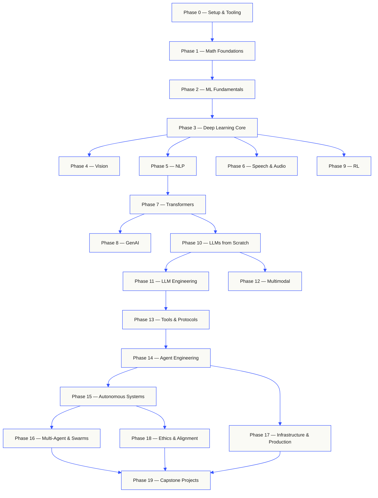

# ai-engineering-from-scratch
* https://github.com/rohitg00/ai-engineering-from-scratch

| Vol | Title                                                                           | Phases     | Download                                                                                                             |
| --- | ------------------------------------------------------------------------------- | ---------- | -------------------------------------------------------------------------------------------------------------------- |
| 1   | Foundations · Math, Tooling, and Classical Machine Learning                     | 00-02      | [PDF](https://github.com/rohitg00/ai-engineering-from-scratch/releases/latest/download/aiefs-vol1-foundations.pdf)   |
| 2   | Deep Learning · Networks, Vision, and Speech                                    | 03, 04, 06 | [PDF](https://github.com/rohitg00/ai-engineering-from-scratch/releases/latest/download/aiefs-vol2-deep-learning.pdf) |
| 3   | Language · NLP Foundations and the Transformer                                  | 05, 07     | [PDF](https://github.com/rohitg00/ai-engineering-from-scratch/releases/latest/download/aiefs-vol3-language.pdf)      |
| 4   | Large Language Models · Generation, Reinforcement, Pretraining, and Engineering | 08-11      | [PDF](https://github.com/rohitg00/ai-engineering-from-scratch/releases/latest/download/aiefs-vol4-llms.pdf)          |
| 5   | Agents · Multimodality, Protocols, Autonomy, and Swarms                         | 12-16      | [PDF](https://github.com/rohitg00/ai-engineering-from-scratch/releases/latest/download/aiefs-vol5-agents.pdf)        |
| 6   | Production · Infrastructure, Safety, and Capstones                              | 17-19      | [PDF](https://github.com/rohitg00/ai-engineering-from-scratch/releases/latest/download/aiefs-vol6-production.pdf)    |

# See Also
