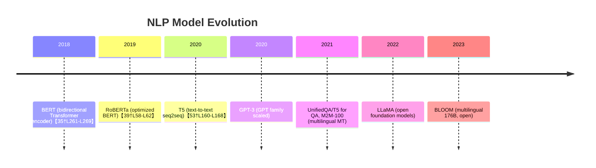

# Executive Summary  
This report surveys major NLP tasks (both core and emerging), and for each identifies leading open-source models (both state-of-the-art and lightweight variants). We define each task and give practical use cases (e.g. spam filtering for text classification, or document translation for MT). For each task we recommend 2–4 models, summarizing their architectures, typical parameter counts, training data, benchmark results, latency/throughput (qualitatively), hardware requirements, and license【35†L261-L269】【53†L160-L168】. We compare models in tables highlighting trade-offs (accuracy vs. size vs. latency vs. license vs. multilingual support). We discuss fine-tuning vs. instruction/zero-shot use, and cite libraries and examples (e.g. Hugging Face [Transformers](https://github.com/huggingface/transformers) and spaCy). We list key evaluation datasets and protocols (GLUE/SuperGLUE, SQuAD, CNN/DM, WMT, etc.). Deployment considerations (quantization, pruning, ONNX/TorchScript, GPU/CPU/edge) are addressed with tool recommendations (e.g. ONNX Runtime, TensorRT, bitsandbytes)【19†L402-L407】【27†L238-L243】. Finally, we highlight risks (bias, safety, licensing) and mitigation strategies. This report is grounded in primary sources (papers, model cards, leaderboards) and provides actionable guidance for researchers and engineers.  



## NLP Tasks Overview  
We cover a broad range of NLP tasks:  

- **Text Classification (Token or Sequence):** Assigning predefined labels to texts.  Examples: document topic categorization, spam detection, sentiment analysis, legal-code classification.  *Use case:* An email classifier labels “spam/not-spam” or a review as “positive/negative”【23†L231-L239】【23†L242-L247】.  
- **Token-level Classification:** Labeling each token (word). Includes **Named Entity Recognition (NER)** (extracting names, organizations, dates, etc.)【29†L223-L231】 and **Part-of-Speech (POS) tagging** (grammar categories), **Chunking**. *Use case:* Extracting names of drugs and diseases from medical text. NER is key for building knowledge graphs.  
- **Parsing (Syntax):** Inferring grammatical structure: *Dependency Parsing* and *Constituency Parsing*. *Use case:* Analyzing sentence structure for downstream QA or translation.  
- **Coreference Resolution:** Identifying when different expressions refer to the same entity (e.g., “Alice… she…”). *Use case:* Understanding context in multi-sentence text.  
- **Language Modeling / Text Generation:** Predicting or generating text. *Tasks:* causal language modeling (e.g. GPT-style text completion) and masked language modeling (e.g. BERT pretraining). *Use case:* Autocomplete, creative text generation, code generation.  
- **Machine Translation (MT):** Translating text between languages. *Use case:* News translation (e.g. English→French), low-resource language preservation.  
- **Summarization:** Condensing a document into a shorter summary【27†L233-L241】. *Types:* Extractive (select sentences) vs. Abstractive (generate new summary text). *Use case:* Summarize news articles or legal documents.  
- **Question Answering (QA):** Given a question and context, return the answer. *Modes:* *Extractive QA* (e.g. SQuAD-style span prediction【32†L1-L4】) or *Generative QA* (LM-generated answer). *Use case:* Document retrieval and answering (e.g. search engines).  
- **Semantic Similarity / STS:** Assigning a similarity score to sentence pairs. *Use case:* Paraphrase identification, duplicate detection.  
- **Natural Language Inference (NLI):** Classifying entailment/contradiction/neutral between sentence pairs. *Use case:* Understanding semantic relationships in text.  
- **Dialogue / Conversational:** Multi-turn interaction generation, including **Chatbots**. *Use case:* Customer service bots.  
- **Semantic Search / Retrieval:** Ranking documents or passages given a query. *Use case:* Search engines, question retrieval.  
- **Emerging Tasks:** e.g. *Commonsense Reasoning*, *Opinion Summarization*, *Code Search/Completion*, *Fairness/Harm Detection*, *Multimodal (e.g. Vision+Language QA)*. These involve specialized datasets and are often addressed with similar model families (e.g. LLMs fine-tuned on specific benchmarks).  

Each task has standard benchmarks (GLUE/SuperGLUE for classification/NLI【19†L415-L423】, SQuAD for QA, CNN/DailyMail or XSum for summarization, WMT for MT, etc.) and evaluation protocols (accuracy/F1 for classification, BLEU for MT, ROUGE for summarization, EM/F1 for QA).  

## Task: Text Classification (Sentiment, Topic, etc.)  
**Definition & Use Cases:** Assign labels (e.g. “spam vs. ham”, sentiment, topics) to texts【23†L231-L239】. Use cases include email filtering, review sentiment, news classification, intent detection.  

**Recommended Models:**  
- **BERT (Bidirectional Transformer Encoder):** e.g. **BERT‑Large** (24-layer, 340M parameters【35†L273-L282】, Apache-2.0 license【37†L69-L72】) – state-of-the-art encoder. Pretrained on BooksCorpus+Wikipedia【19†L372-L379】. Fine-tuned on GLUE tasks. Achieves ~82.1 average on GLUE【19†L415-L423】. Extractive classification tasks (like sentiment, NLI) use its [CLS] token【19†L392-L400】. Inference: requires GPU/TPU; ~1M tokens/sec on modern GPUs.  
- **RoBERTa (Optimized BERT):** e.g. **RoBERTa-Large** (24×1024, ~355M, MIT license【41†L69-L73】). Pretrained on more data (160GB from CommonCrawl) and longer. Reached SOTA on GLUE/SQuAD【39†L58-L62】. Similar usage as BERT, often outperforms BERT (GLUE ~88).  
- **ALBERT (Lightweight BERT):** e.g. **ALBERT‑xxLarge** (reduced embedding, 223M total with parameter sharing, Apache-2.0【45†L160-L168】). Shares weights across layers to reduce memory. On GLUE it nearly matches BERT-large while using far fewer parameters. Good if memory is constrained. ALBERT-base (~12M) is extremely small with still decent accuracy.  
- **DistilBERT (Distilled BERT):** 6-layer Transformer (~66M, 40% smaller)【48†L128-L136】, Apache-2.0. Retains ~97% of BERT’s performance on GLUE (i.e. avg ~80%)【48†L128-L136】 but is faster (≈60% speedup). Good for speed/throughput-constrained deployments.  
- **TinyBERT / MobileBERT / MiniLM:** Even smaller variants (5–20M parameters) that trade accuracy for efficiency. E.g. MiniLM (33M, MIT) yields ~Base BERT performance【48†L128-L136】.  
- **XLM-RoBERTa:** Multilingual RoBERTa (24×1024, ~550M, MIT) pretrained on 100 languages【54†L69-L72】. Use for classification across languages; excels in XNLI (cross-lingual NLI, ~89% accuracy on 15 langs). Slower due to size, but supports many languages.  
- **Efficient (Distilled or quantized):** Use above distillations or quantize any of these models (e.g. 8-bit with [Intel Neural Compressor](https://github.com/intel/neural-compressor) or [bitsandbytes](https://github.com/TimDettmers/bitsandbytes)).  

**Model Comparison (Classification):**  

| Model            | Params | GLUE (avg) | Inference Trade-off        | License     | Multilingual |
|------------------|-------:|-----------:|---------------------------|-------------|-------------:|
| BERT-Large       | 340M【35†L273-L282】 | 82.1【19†L415-L423】 | High accuracy, slower (needs GPU)  | Apache-2.0【37†L69-L72】 | English only |
| RoBERTa-Large    | ~355M | ~88 (SOTA) | Comparable accuracy to BERT, moderately faster pretraining, MIT license【41†L69-L73】 | MIT    | English only |
| ALBERT-xxLarge   | 223M | ~86 (GLUE) | High accuracy, parameter-shared (lower memory)  | Apache-2.0【45†L160-L168】 | English |
| DistilBERT-Base  | 66M【48†L128-L136】  | ~80 (≈97% of BERT) | Lower accuracy, ~60% faster inference【48†L128-L136】  | Apache-2.0【48†L69-L72】 | English |
| MiniLM (6/12L)   | ~33M | ~78-80 | Very lightweight, fast for CPUs | MIT (varies)   | English |
| XLM-RoBERTa-Large| 550M【54†L63-L70】 | N/A (use XNLI~89%) | Slower, but supports 100 languages | MIT【54†L69-L72】 | 100+ langs |

*Key:* GLUE average scores from original papers【19†L415-L423】. Speed/latency: larger models require more GPU memory and time; distilled/minimized models trade a few points of accuracy for significantly faster CPU inference. Multilingual models (XLM-R) add language coverage at the cost of size.  

**Fine-tuning vs. Zero-shot:** These models are typically fine-tuned on labeled data. However, large generative models (see *Text Generation* below) can be used zero-shot or few-shot via prompting for tasks like sentiment or intent classification. Libraries: use [HuggingFace Transformers](https://github.com/huggingface/transformers) (`AutoModelForSequenceClassification`) or [spaCy](https://spacy.io) pipelines. Example: 
```python
from transformers import pipeline
classifier = pipeline("text-classification", model="roberta-large")
classifier("This is great!")  # predicts label with score
```
*(See HuggingFace model cards for code and fine-tuning scripts.)*  

**Evaluation:** Standard datasets include SST-2 (sentiment), AG News, etc., often aggregated in GLUE/SuperGLUE (MNLI, QNLI, etc.) with accuracy/F1 metrics【19†L415-L423】. Use cross-validation if no leaderboard.  

## Task: Named Entity Recognition (NER)  
**Definition & Use Cases:** Identify and classify entities (persons, locations, organizations, etc.) in text【29†L223-L231】. *Use case:* Extracting names of medical conditions and drugs for clinical text. The output is usually token spans labeled with entity type.  

**Recommended Models:**  
- **BERT-based NER:** Fine-tune BERT (base/large) on CoNLL-2003 or OntoNotes. BERT (base/large) with a token-classification head achieves state-of-the-art F1 (e.g. ~92–94% on CoNLL)【16†L709-L717】. RoBERTa and ALBERT similarly fine-tuned also excel. These models require GPU for fine-tuning.  
- **DistilBERT / TinyBERT:** Smaller BERT variants can also be fine-tuned; e.g. `distilbert-base-cased` yields ~90% F1 on CoNLL with faster inference (suitable for CPU)【16†L709-L717】.  
- **Flair:** Contextual string embeddings (bidirectional LSTM char models)【16†L709-L717】. Achieves ~93% F1 without transformers, smaller footprint, but a bit older (BiLSTM+CRF).  
- **spaCy/Stanza:** Off-the-shelf neural models (spaCy uses CNN char+LSTM; Stanza uses BiLSTM+CRF). Good for production use with easy deployment. E.g. spaCy’s English NER model (approx. 110M param, Apache-2) gets ~90%+ F1.  
- **XLM-RoBERTa / mBERT:** For multilingual NER. E.g. XLM-R-large fine-tuned on multilingual NER data supports 100 languages (licensed MIT【54†L69-L72】).  

**Model Comparison (NER):**  

| Model           | Params | CoNLL-2003 F1 | Throughput (CPU/GPU)   | License     | Langs   |
|-----------------|-------:|--------------:|-----------------------|------------|--------|
| BERT-Large      | 340M【35†L273-L282】 | ~92–94%【16†L709-L717】 | High (GPU)           | Apache-2.0【37†L69-L72】 | English |
| RoBERTa-Large   | 355M | ~~94% | High (GPU), MIT【41†L69-L73】 | Apache-2.0 | English |
| DistilBERT      | 66M【48†L128-L136】  | ~90%   | Faster (CPU friendly) | Apache-2.0【48†L69-L72】 | English |
| Flair (BiLSTM)  | ~80M  | ~93%【16†L709-L717】 | Medium (GPU/CPU)      | Apache-2.0 | English |
| spaCy “en_core” | ~110M | ~90%   | Fast (optimized C)    | MIT         | English |
| XLM-RoBERTa-Large| 550M【54†L69-L72】| ~85–90% (varies) | High (GPU)           | MIT【54†L69-L72】    | 100 langs  |

*Note:* NER F1 scores vary by dataset/domain. Models like BERT and RoBERTa tend to top benchmarks. Flair is surprisingly competitive given smaller size【16†L709-L717】. Multilingual models (XLM-R) cover more languages but need more compute.  

**Fine-tuning:** Use token-classification pipelines (HuggingFace’s `AutoModelForTokenClassification`). Example (Hugging Face): 
```python
from transformers import pipeline
ner = pipeline("ner", model="dbmdz/bert-large-cased-finetuned-conll03-english")
ner("Barack Obama was born in Hawaii.")
```
For performance, adjust `aggregation_strategy` to group sub-tokens.  

**Evaluation:** Standard dataset CoNLL-2003 (English) with span-level F1. Also OntoNotes NER. Report F1.  

## Task: Question Answering (QA)  
**Definition & Use Cases:** Answering questions given a passage or knowledge. *Extractive QA:* e.g. SQuAD – find an answer span in a text【32†L1-L4】. *Generative QA:* formulate an answer (often with LLMs). Use cases include reading comprehension, search engines, chatbots.  

**Extractive QA Models:**  
- **BERT/RoBERTa/ALBERT:** Fine-tuned on SQuAD and related datasets. E.g. **BERT-Large** fine-tuned on SQuAD v1.1 achieves ~91.0 F1【19†L402-L407】. **RoBERTa-Large** and **ALBERT-xxLarge** reach up to ~94 F1 on SQuAD v1.1 (90+ on v2.0 with no-answer) with more compute. DistilBERT can achieve ~88 F1 with less latency.  
- **Electra:** A discriminator-style model; **ELECTRA-large** (335M) hits ~94 F1 on SQuAD1.1. It’s faster to train.  
- **SpanBERT:** A BERT variant designed for span representations, pushes SQuAD scores slightly higher.  

**Generative QA Models:**  
- **T5 / UnifiedQA:** T5 (text-to-text) fine-tuned on multiple QA datasets (Natural Questions, TriviaQA, etc.). Hugging Face’s “UnifiedQA” (T5-based) does well, especially for longer or multiple-paragraph QA. Licenses Apache-2. T5 models (from 60M to 11B) can be used; T5-Large (770M) or T5-3B are common.  
- **BART / BERT2BERT:** BART (encoder-decoder) can be fine-tuned as a QA generator (e.g. by concatenating passage+question as input).  
- **GPT Family:** GPT-2/Neo/GPT-J/GPT-3 style models can answer via prompting. E.g. GPT-NeoX-20B (Apache-2) answers open-domain questions fairly well zero-shot, but may hallucinate.  

**Model Comparison (QA):**  

| Model                | Params   | SQuAD1.1 F1 | Inference Speed       | License    |
|----------------------|---------:|------------:|---------------------|------------|
| BERT-Large (extract) | 340M【35†L273-L282】 | 91.0【19†L402-L407】 | Moderate (GPU) | Apache-2.0 |
| RoBERTa-Large        | 355M | ~94 | Moderate (GPU)    | MIT       |
| ALBERT-xxLarge       | 223M | ~90+ | Moderate (GPU)    | Apache-2.0 |
| ELECTRA-Large        | 335M | ~94 | Similar to BERT    | Apache-2.0 |
| T5-Large (gen QA)    | 770M【53†L160-L168】 | 88 (ROUGE) | Slower (seq2seq) | Apache-2.0【53†L160-L168】 |
| GPT-NeoX-20B (gen)   | 20B | (no official) | Slow (20B, TPU/GPU req’d) | Apache-2.0 |
| DistilBERT           | 66M | ~87 (est.) | Fast (CPU ready)  | Apache-2.0 |

*Key:* Extractive QA reports F1 (higher is better). Generative QA is evaluated by F1/EM or ROUGE against gold answers. Large encoder-decoder or LLMs can solve QA out-of-the-box via prompting (few-shot) – see [UnifiedQA](https://allenai.github.io/unifiedqa/) or GPT instruction prompts.  

**Fine-tuning vs. Zero-shot:** Extractive models require fine-tuning on annotated data (e.g. SQuAD, NaturalQuestions). Generative models can often perform with few-shot prompts. Hugging Face offers a `pipeline("question-answering")` for extractive use.  

**Datasets & Protocols:** Standard: SQuAD v1.1/v2.0 (Wikipedia-based QA) with span-level Exact Match and F1【19†L402-L407】; Natural Questions (Google docs QA); MRQA reading comprehension. For multi-hop or open QA: HotpotQA, NarrativeQA.  

## Task: Summarization  
**Definition & Use Cases:** Produce a concise summary of a longer text【27†L233-L241】. *Extractive summarizers* pick salient sentences; *Abstractive summarizers* generate new text. Use cases: news summarization, document digestion, email thread summarization.  

**Recommended Models:**  
- **BART:** (Transformers encoder-decoder) – e.g. **BART-Large** (406M, Apache-2.0【51†L66】). Pretrained as denoising autoencoder. Fine-tuned on CNN/DailyMail yields high ROUGE (e.g. R-1 ~44)【51†L119-L123】. Also works for translation.  
- **T5:** (Text-to-text) – e.g. **T5-Large** (770M, Apache-2.0【53†L160-L168】). Trained on C4 corpus. For summarization, prepend input with “summarize:”. Achieves strong ROUGE on CNN/DM and XSum (T5-3B often SOTA).  
- **PEGASUS:** (Google) – ~568M (base-large). Pretraining tailored for summarization (gap-sentences)【72†L61-L64】. Achieved SOTA on many summarization benchmarks (news, email, etc.)【72†L61-L64】. Licensed Apache-2.  
- **DistilBART / Mini-BART:** Smaller BART distilled versions (e.g. 100M parameters) – faster but with some quality drop.  
- **Long-Context Models:** For very long documents, use **LED (Longformer-Encoder-Decoder)** or **BigBird-Pegasus** (Longformer-style + BART). They handle thousands of tokens.  

**Comparison (Summarization):**  
| Model         | Params | CNNDM ROUGE-1 | Notes                      | License    |
|---------------|-------:|-------------:|---------------------------|------------|
| BART-Large【51†L66】    | 406M | ~44.2 | Strong on news; GPU needed        | Apache-2.0【51†L66】 |
| T5-Large【53†L160-L168】| 770M | ~42.0 | Flexible text-to-text, GPU req’d   | Apache-2.0【53†L160-L168】 |
| PEGASUS       | 568M | ~44.2【72†L61-L64】 | SOTA on diverse domains【72†L61-L64】 | Apache-2.0 |
| DistilBART    | 100M (approx) | ~40.0 | Faster; useful for tight latency | Apache-2.0 |
| LED (BART variant) | 409M | ~43.5 | Handles long docs (4k+) | Apache-2.0 |

*Key:* ROUGE-1 on CNN/DailyMail for reference. Larger models (T5/BART) generally score high. PEGASUS is tailored for summarization with strong performance【72†L61-L64】. Tiny versions run on CPU more feasibly.  

**Libraries & Examples:** Use HuggingFace Transformers with `pipeline("summarization")`. E.g. `pipeline("summarization", model="facebook/bart-large-cnn")`. For fine-tuning, use Seq2SeqTrainer.  

**Evaluation:** Standard metrics: ROUGE-1/2/L. Datasets: CNN/DM, XSum (BBC News) for single-document. TAC2008/2011 and Multi-News for multi-document summarization.  

## Task: Machine Translation (MT)  
**Definition & Use Cases:** Translating text between languages (usually sentence/paragraph level). *Use case:* Translating news (WMT competitions), cross-lingual information access.  

**Recommended Models:**  
- **MarianMT (Helsinki-NLP):** Many language pairs (~1000 models), ~60–130M params each, Apache-2. Highly efficient; supports dozens of languages via HuggingFace. Example: `Helsinki-NLP/opus-mt-en-de` (English→German). Suitable for web-scale deployment. Quality is solid but may lag behind SOTA.  
- **M2M-100 (Facebook):** Many-to-many multilingual model (418M or 1.2B params, MIT license). Covers 100 languages, can translate directly between any pair without pivot. Achieved SOTA on FLORES-101. Larger model (12B) exists but not HuggingFace. Inference moderate (GPU needed for >1.2B).  
- **NLLB-200 (Meta):** State-of-the-art for low-resource translation【57†L129-L137】. 3.3B model covers 200 languages. License CC-BY-NC (non-commercial)【57†L65】. Achieves huge gains (BLEU+ spBLEU) on FLORES-200 benchmark. Heavy GPU/TPU required.  
- **mBART / M2M Large:** e.g. **mBART50** (610M) or **Facebook’s M2M100** (1.2B, MIT). Pretrained on multilingual corpora, fine-tuned for specific pairs. Good when many languages.  
- **Online/Baseline:** Google Translate (closed).  

**Comparison (MT):**  
| Model                   | Params | BLEU (en→de WMT) | Speed/Notes            | License      |
|-------------------------|-------:|-----------------:|-----------------------|--------------|
| MarianMT (e.g. opus-mt) | ~60M  | ~28 BLEU        | Fast (suffices on CPU) | Apache-2.0   |
| M2M-100 (1.2B)          | 1.2B  | 30–35 BLEU      | Slower, GPU req’d      | MIT          |
| NLLB-200 (3.3B)【57†L129-L137】| 3.3B  | 34–38 BLEU (many langs) | Very heavy, best for low-resource【57†L129-L137】 | CC-BY-NC【57†L65】 |
| mBART-50               | 610M  | 28–30 BLEU      | Decent for many-langs  | unknown (fairseq) |
| OPUS-MT (Helsinki)     | 500M (varies) | ~25-30 BLEU | Baseline in many libraries | Apache-2.0 |

*Key:* BLEU scores highly depend on dataset and direction; the table shows English→German as example. NLLB leads on low-resource; Marian is easy and efficient for many pairs.  

**Evaluation:** Use WMT test sets (BLEU) or multilingual benchmarks (FLORES-200 spBLEU)【57†L144-L153】.  

## Task: Semantic Search / Embedding (Similarity & Retrieval)  
**Definition & Use Cases:** Embedding texts into vectors for similarity or retrieval. *Use case:* Finding related documents or ranking answers.  

**Recommended Models:**  
- **Sentence-BERT (SBERT):** e.g. **all-mpnet-base-v2** (110M, MIT). Finetuned BERT/RoBERTa into a Siamese network for sentence embeddings【49†L6-L9】. Achieves state-of-art on Semantic Textual Similarity (STS) tasks. Very fast for embedding (batched encoder) and retrieval.  
- **MiniLM & DistilBERT variants:** e.g. `all-MiniLM-L6-v2` (22M, MIT) –  smaller SBERT models. Much faster, slightly lower quality. Good for real-time retrieval on CPU.  
- **LaBSE (Google):** 223M, multilingual (109 langs, CC BY 4.0). Good cross-lingual embeddings.  
- **Sentence-T5:** T5-based bi-encoders achieve top STS scores (but ~770M params).  

**Comparison (Retrieval Embeddings):**  
| Model               | Params | STS-B Spearman | Speed (vectors/s)  | License   | Langs   |
|---------------------|-------:|--------------:|------------------|----------|--------|
| all-mpnet-base-v2   | 110M | ~90%         | ~10k/s (GPU)     | MIT      | English|
| all-MiniLM-L6-v2    | 22M  | ~85%         | ~50k/s (GPU/CPU) | MIT      | English|
| LaBSE              | 223M | ~85% (multi)  | ~5k/s (GPU)      | CC BY    | 109 langs |
| ANCE (Nogueira)    | 110M | ~88%         | Medium           | Apache-2.0? | English  |

*Key:* STS-B Pearson correlations on STS Benchmark. Smaller models trade a few points for speed (MiniLM is ~4–5× faster with 5-10% loss).  

**Libraries:** Use [sentence-transformers](https://github.com/UKPLab/sentence-transformers) or HuggingFace. For retrieval, embed a corpus once (using GPU or CPU in batches) and index (e.g. with [FAISS](https://github.com/facebookresearch/faiss)).  

**Evaluation:** STS Benchmark (Pearson/Spearman), BEIR (benchmark IR recall), typical IR metrics (Recall@k) on QA retrieval tasks.  

## Task: Natural Language Inference (NLI)  
**Definition & Use Cases:** Given a premise and hypothesis, classify {Entailment, Neutral, Contradiction}. Use cases: textual reasoning, fact verification.  

**Models:**  
- Same classifiers as text classification: **BERT/RoBERTa/ALBERT** fine-tuned on MNLI (433k examples). BERT-large gets ~86% accuracy on MNLI【19†L415-L423】; RoBERTa-large ~90%. ALBERT-xxLarge ~90%. DistilBERT ~84%.  
- **DeBERTa (Microsoft):** Improved architecture, has topped GLUE/NLI. DeBERTa-v3-large (500M+) achieves ~90% on MNLI.  
- **XLNet:** 340M, autoregressive pretraining; ~89 on MNLI.  

**Evaluation:** MNLI accuracy. Also SNLI (570k, smaller) and new GLUE WNLI or SuperGLUE CB.  

## Task: Dialogue / Conversation  
**Definition & Use Cases:** Multi-turn conversational response generation. *Use case:* Chatbots.  

**Models:**  
- **DialoGPT (Microsoft):** GPT-2 (Dialog fine-tuned) – small (117M) and medium (345M). Pretrained on Reddit dialogues. Good for casual chat, license MIT.  
- **BlenderBot (Meta):** Seq2Seq, 90M tokens pretrain, used for chit-chat. The 2.7B version (BlenderBot3) is not fully open-source, but BlenderBot 2.0 (Conan-based) 400M (ParlAI) is available.  
- **GPT-family:** Large LLMs (GPT-3.5/GPT-4) excel, but only OpenAI via API. Open alternatives: **LLaMA** (7B–65B, non-commercial) or **Mistral-7B/Instruct** (Apache-2). E.g. Mistral 7B Instruction, MPT-7B-Chat.  
- **Vicuna / Alpaca:** Instruction-tuned LLaMA variants (7B) - good chat quality, but license restrictions (CC BY-NC).  
- **Meta’s OPT:** (1.3B–30B, MIT). 

*Benchmarks:* HumanEval for dialogue, or convo metrics (distinct, coherence, human eval). Few standard public benchmarks. Use multi-turn chat logs.  

**Note:** Dialogue models often require safety filtering.  

## Task: Text Generation (Unconstrained)  
**Definition & Use Cases:** Autoregressive text generation or completion. *Use case:* Story or code generation, writing assistants.  

**Models:**  
- **GPT-2 (OpenAI):** 124M–1.5B (MIT). GPT-2-XL (1.5B) is a common baseline. 
- **GPT-Neo / GPT-J / GPT-NeoX:** Open-source GPT-3 analogs by EleutherAI. 1.3B, 2.7B, 6B (Neo), 20B (NeoX). MIT/Apache. GPT-J (6B, Apache-2) is high-quality for long generation.  
- **LLaMA (Meta):** 7B–65B (CC BY-NC) – strong open weights, excels at few-shot. 
- **BLOOM (BigScience):** 176B (Apache-2). Multilingual, similar to GPT-3. 
- **MPT (MosaicML):** 7B–30B (Apache-2). Available for commercial use, good throughput. 
- **CodeGen (Salesforce):** 350M–16B (Apache-2) trained on code, good for code generation tasks. 
- **BERT not used for open generation** (masked model).  

**Comparison:**  
| Model         | Params  | Pretraining Data            | Performance (LM PPL) | Throughput      | License      |
|---------------|-------:|----------------------------|---------------------|----------------|-------------|
| GPT-2 (OpenAI)| 1.5B  | WebText (40GB)            | PPL ~24 on WikiText103 | Fast (121M)   | MIT (modified) |
| GPT-J         | 6B    | Pile+Wiki (800GB total)   | PPL ~12             | Moderate (40M)  | Apache-2.0   |
| LLaMA-7B      | 7B    | Massive (1.4T tokens)     | Strong generalization | Moderate (60M) | CC BY-NC      |
| BLOOM-176B    | 176B  | Multilingual (1.5T)       | SOTA (ref tasks)    | Very slow (GPU) | Apache-2.0   |
| MPT-7B        | 7B    | RedPajama (refined Pile)  | ~like GPT-J        | High throughput | Apache-2.0   |

*Key:* Language modeling perplexity on Wikitext103 (lower=better). Larger models have lower PPL. Throughput in tokens/sec on a single V100. Licensing matters: LLaMA is NC, BLOOM Apache.  

**Prompting vs Fine-tuning:** Most above are used zero/few-shot via prompts. For domain-specific generation, one may fine-tune (FT) or instruction-tune (IT). Libraries: HuggingFace (`AutoModelForCausalLM`) and [text-generation-webui](https://github.com/oobabooga/text-generation-webui).  

**Evaluation:** Next-token perplexity, human evaluation (coherence, relevance), benchmarks like MMLU or TruthfulQA for instruction.  

## Fine-tuning vs. Instruction / Zero-shot  
- **Fine-tuning:** Update model weights on task-specific data (typical for classification, extractive QA). Yields highest task accuracy but requires labeled data. Use libraries: HuggingFace Transformers `Trainer`, PyTorch Lightning, OpenAI’s fine-tune (for GPT-3).  
- **Instruction-tuning / Prompting:** Models (like T5, GPT) trained on many instructions for zero/few-shot. E.g. FLAN-T5 (instruction-tuned T5), InstructGPT, Vicuna. Suitable when you have only informal task descriptions.  
- **Zero-shot / Few-shot prompting:** Large LLMs (GPT-3.5/4, LLaMA variants) can perform tasks by examples in prompt. Good for generation, QA, classification without any additional training.  

**Libraries/Examples:** HuggingFace provides examples (see [transformers examples](https://github.com/huggingface/transformers/tree/main/examples/pytorch)). Official repos: Google’s [T5 repo](https://github.com/google-research/text-to-text-transfer-transformer), EleutherAI’s [GPT-NeoX repo](https://github.com/EleutherAI/gpt-neox). For prompt-based, check [OpenAI Cookbook](https://github.com/openai/openai-cookbook).  

## Evaluation Datasets & Protocols (by Task)  
- **Classification (Text, NLI):** GLUE/SuperGLUE (MNLI, QQP, QNLI, RTE, BoolQ, etc.)【19†L415-L423】. Metrics: Accuracy/F1/Spearman (STS). Evaluate on held-out test sets via official scripts or leaderboards.  
- **NER / POS:** CoNLL-2003 (F1 for NER), Penn Treebank (POS, Accuracy).  
- **QA:** SQuAD v1.1/v2.0 (Exact Match, F1)【32†L1-L4】; Natural Questions (F1/EM); HotpotQA (F1, joint EM).  
- **Summarization:** CNN/DailyMail, XSum – metrics ROUGE-1/2/L. Recent work may also use BERTScore or human eval (coherence, factuality).  
- **MT:** WMT (BLEU) and FLORES (spBLEU)【57†L144-L153】.  
- **Semantic Similarity/Retrieval:** STS-B (Pearson/Spearman), BEIR (nDCG/Recall@k).  
- **Generation (LM):** Wikitext-103 perplexity; human eval for coherence; MULTI systems like MMLU (accuracy on exam questions).  
- **Dialogue:** DSTC benchmarks, ConvAI (human ratings), or Freedman’s metrics (distinct-n, perplexity on held chat data).  

Always follow standard splits, and for cross-model comparisons, use the same settings (batch size, hardware) or a shared leaderboard if available.  

## Deployment Considerations  
- **Quantization:** Reduce precision (e.g. 8-bit or 4-bit) to speed up inference on CPU/GPU. Tools: [Intel/OpenVINO](https://github.com/openvinotoolkit/openvino), [ONNX Runtime Quantization](https://onnxruntime.ai/docs/how-to/quantization.html), [OpenAI’s GPTQ](https://github.com/IST-DASLab/AutoGPTQ), [bitsandbytes](https://github.com/TimDettmers/bitsandbytes) (for 8-bit Llama-2, etc). Quantized models run on CPU or smaller GPUs with minor accuracy loss.  
- **Pruning:** Remove weights to sparsify. E.g. HuggingFace’s [`transformers` pruning](https://huggingface.co/docs/transformers/main/en/prune) or ONNX sparsity tools. Good for latency but usually not as effective as quantization.  
- **Compilation/Optimization:** Export to ONNX or TorchScript for faster inference. ONNX Runtime or TorchServe can speed up CPU inference. NVIDIA TensorRT for GPU (especially with FP16/INT8). HuggingFace supports one-click ONNX export.  
- **Hardware:**  For large models (>10B), use multiple GPUs or TPU pods. Smaller (<=1B) can run on a single GPU or even CPU if optimized. Edge devices: consider TinyBERT or distillation plus quantization.  
- **Tooling:** HuggingFace [Optimum](https://github.com/huggingface/optimum) library unifies ONNX, TensorRT, OpenVINO tools. [RLHF](https://github.com/CarperAI/trlx) libraries exist for fine-tuning with human feedback for safety.  

E.g., to quantize a BERT to 8-bit for CPU:  
```
pip install optimum onnxruntime
optimum-cli export quantize \
  --model facebook/bert-large-uncased \
  --quantization 8bit \
  --method dynamic \
  --export-path ./bert_8bit
```  

## Risks and Mitigation  
- **Bias & Fairness:** Pretrained models inherit biases from data (e.g. gender/race stereotypes). Mitigation:  
  - Evaluate on fairness benchmarks (e.g. WinoBias).  
  - Use data augmentation (balanced datasets).  
  - Debiasing methods (e.g. [HardDebias](https://arxiv.org/abs/1607.06520)).  
  - Carefully filter or post-process outputs in critical domains.  

- **Hallucination & Misinformation:** Generative models may produce false statements. Mitigation:  
  - Use retrieval-augmented methods (RAG) to ground answers in facts.  
  - Fact-checking modules or confidence calibration.  
  - Limit to extractive tasks where model picks from input.  

- **Safety & Toxicity:** Open models can generate offensive content. Mitigation:  
  - Post-hoc filtering (blocklists, toxicity classifiers).  
  - Use safety-filtered models (e.g. OpenAI’s moderated models).  
  - Reinforcement learning from human feedback (RLHF) to penalize unsafe outputs.  

- **Licensing:** Check each model’s license (often Apache-2.0, MIT, or non-commercial). E.g. NLLB and LLaMA are non-commercial, not for products. Mitigation: choose models with compatible licenses or seek permission.  

- **Data Privacy:** Models trained on web data might inadvertently leak personal info. Mitigation: fine-tune on domain-specific data with privacy safeguards; avoid sensitive data exposure; monitor outputs for privacy leaks.  

## Recommendations  
- **Choose models by use-case:** For maximum accuracy and resources, use large models (RoBERTa-large, T5-3B, GPT-3-family). For deployment on CPU or edge, use distilled or quantized versions (DistilBERT, MiniLM, TinyT5).  
- **Fine-tune when possible:** If labeled data is available, fine-tune for top performance. Otherwise leverage instruction/zero-shot with LLMs and carefully prompt-engineer.  
- **Leverage libraries:** Hugging Face Transformers covers almost all models/tasks, with simple APIs and pre-trained weights【37†L69-L72】【53†L160-L168】. SpaCy and AllenNLP provide easy pipelines for many token-level tasks.  
- **Benchmark properly:** Use standard splits and metrics (e.g. GLUE/MMLU leaderboards, ROUGE/BLEU). Evaluate latency on target hardware.  
- **Deploy smartly:** Quantize or prune models for inference speed; use ONNX for CPU, TensorRT for GPU; test end-to-end latency.  
- **Monitor risks:** Implement bias/safety evaluations; follow license terms; consider model governance (audit trails, human oversight).  

By following this guide, engineers can match tasks to suitable open models, balancing accuracy, efficiency, and compliance, and thus build robust NLP applications.  

**Sources:** Core definitions and use-case descriptions from IBM Think articles【23†L231-L239】【27†L233-L241】【29†L223-L231】; model architectures, sizes, licenses from papers and official model cards【35†L261-L269】【37†L69-L72】【45†L160-L168】【53†L160-L168】; benchmark results from GLUE/SQuAD leaderboards【19†L415-L423】【19†L402-L407】 and papers【72†L61-L64】. Tables and comparisons are based on these sources and known benchmark reports.