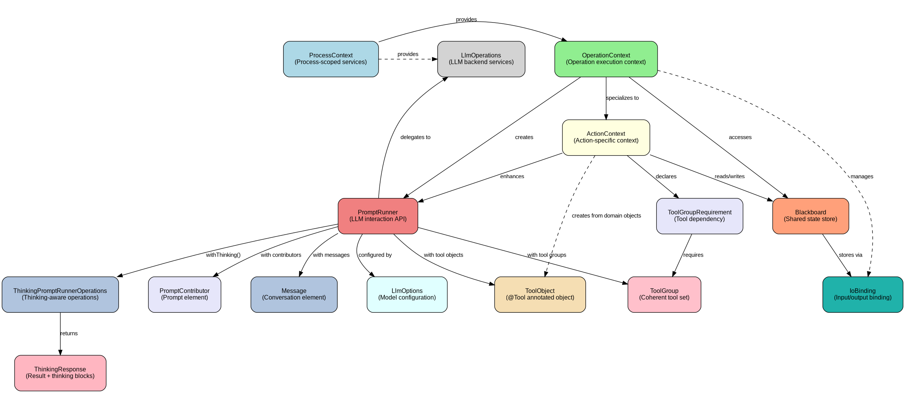
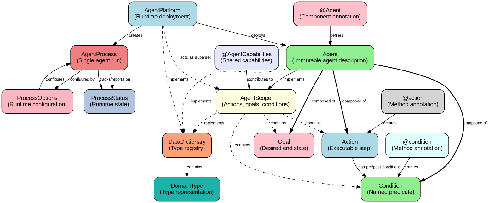
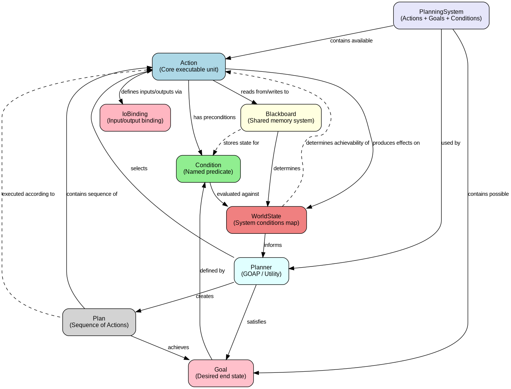

# Embabel
* https://github.com/embabel/embabel-agent

Embabel (Em-BAY-bel) is a framework for authoring agentic flows on the JVM that seamlessly mix LLM-prompted interactions with code and domain models. Supports intelligent path finding towards goals. Written in Kotlin but offers a natural usage model from Java. From the creator of Spring./Embabel（发音为 Em-BAY-bel）是一个用于在 JVM 上编写智能流程的框架，它能够无缝地将 LLM 提示的交互与代码和领域模型融合在一起。它支持智能路径查找，引导用户达成目标。Embabel 使用 Kotlin 编写，但提供了与 Java 兼容的自然使用模型。它出自 Spring 的创建者之手。

# 0.5.0-SNAPSHOT
* https://docs.embabel.com/embabel-agent/guide/0.5.0-SNAPSHOT/

## 1. Overview
- 1.1. Glossary
- 1.2. Why do we need an Agent Framework?
- 1.3. Embabel Differentiators/差异化因素
  - 1.3.1. Sophisticated Planning/精细的规划
  - 1.3.2. Superior Extensibility and Reuse/高可扩展性和可重用性
  - 1.3.3. Strong Typing and Object Orientation/强类型和面向对象
  - 1.3.4. Platform Abstraction/平台抽象
  - 1.3.5. LLM Mixing/LLM混合
  - 1.3.6. Spring and JVM Integration/Spring和JVM集成
  - 1.3.7. Designed for Testability/为可测试性而设计
- 1.4. Core Concepts
  - 1.4.1. Complete Example
  - 1.4.2. The Inferred Execution Plan for the Example
  - 1.4.3. Key Benefits of Type-Driven Flow
## 2. Getting Started
- 2.1. Quickstart
- 2.2. Getting the Binaries
  - 2.2.1. Build Configuration
  - 2.2.2. Environment Setup
- 2.3. Getting Embabel Running
  - 2.3.1. Running the Examples
  - 2.3.2. Prerequisites
  - 2.3.3. Using the Shell
  - 2.3.4. Example Commands
  - 2.3.5. Implementing Your Own Shell Commands
- 2.4. Adding a Little AI to Your Application
- 2.5. Writing Your First Agent
  - 2.5.1. Example: WriteAndReviewAgent
  - 2.5.2. Key Concepts Demonstrated
  - 2.5.3. Running Your Agent
  - 2.5.4. Next Steps
## 3. Embabel Shell
- 3.1. How to Use the Shell
  - 3.1.1. Starting the Shell
  - 3.1.2. Navigating the Shell
  - 3.1.3. How User Input Reaches an Agent
  - 3.1.4. Logging Verbosity
- 3.2. Shell Commands
  - 3.2.1. Agent Execution Commands
  - 3.2.2. Tool Call Context Commands
  - 3.2.3. Implementing Custom Shell Commands
- 3.3. Embabel Modules
  - 3.3.1. Module Directory
  - 3.3.2. Experimental APIs: `@ApiStatus.Experimental`

Core Modules

| Name                   | Purpose                   | Notes                                          | Status     |
| ---------------------- | ------------------------- | ---------------------------------------------- | ---------- |
| `embabel-agent-api`    | Core API                  | Main programming interface for building agents | Stable     |
| `embabel-agent-domain` | Domain types and entities | Shared domain model                            | Incubating |

Feature Modules

| Name                      | Purpose                                    | Notes                                                                                                            | Status       |
| ------------------------- | ------------------------------------------ | ---------------------------------------------------------------------------------------------------------------- | ------------ |
| `embabel-agent-a2a`       | Agent-to-Agent protocol support            | Google A2A protocol implementation                                                                               | Incubating   |
| `embabel-agent-code`      | Coding domain library                      | Code analysis and generation utilities                                                                           | Stable       |
| `embabel-agent-discord`   | Discord bot integration                    | Build agents as Discord bots                                                                                     | Experimental |
| `embabel-agent-eval`      | Agent evaluation framework                 | Assess agent performance on tasks                                                                                | Experimental |
| `embabel-agent-mcpserver` | MCP server support                         | Export agents as MCP servers                                                                                     | Stable       |
| `embabel-agent-openai`    | OpenAI-specific utilities                  | Structured outputs, response format                                                                              | Stable       |
| `embabel-agent-onnx`      | Local ONNX Runtime inference               | Local embedding models via ONNX Runtime. Default: `all-MiniLM-L6-v2`                                             | Incubating   |
| `embabel-agent-remote`    | Remote action support                      | Execute actions on remote systems, enabling dynamic registration to extend the capabilities of an Embabel server | Experimental |
| `embabel-agent-shell`     | Command-line interface                     | Interactive shell for agent development                                                                          | Stable       |
| `embabel-agent-skills`    | Support for emerging Agent Skills standard | Composable agent skills                                                                                          | Experimental |
| `embabel-agent-spec`      | Serializable action and goal definitions   | Enables agents to be defined in YML or otherwise persisted in a serialized format                                | Experimental |

RAG and Context Engineering Modules

| Name                            | Purpose                                                                                                                                                       | Notes                                                                                                                                                                                                   | Status     |
| ------------------------------- | ------------------------------------------------------------------------------------------------------------------------------------------------------------- | ------------------------------------------------------------------------------------------------------------------------------------------------------------------------------------------------------- | ---------- |
| `embabel-agent-rag-core`        | Core RAG abstractions                                                                                                                                         | Base interfaces for RAG, encompassing programming model (`ToolishRag`), storage abstractions (`SearchOperations`) and document model.                                                                   | Stable     |
| `embabel-agent-rag-lucene`      | Lucene RAG store                                                                                                                                              | Local storage with Apache Lucene supporting vector and text search                                                                                                                                      | Stable     |
| `embabel-agent-rag-tika`        | Apache Tika integration                                                                                                                                       | Document parsing (Markdown, PDF, Word, etc.)                                                                                                                                                            | Incubating |
| `embabel-agent-rag-neo-drivine` | Neo4j graph RAG: `embabel/embabel-agent-rag-neo-drivine`                                                                                                      | RAG store for Neo4j graph database                                                                                                                                                                      | Incubating |
| `embabel-rag-pgvector`          | PostgreSQL pgvector RAG: `embabel/embabel-rag-pgvector`                                                                                                       | RAG store for PostgreSQL with pgvector extension supporting hybrid search (vector, full-text, fuzzy)                                                                                                    | Incubating |
| `dice`                          | Support for [Domain Oriented Context Engineering](https://medium.com/@springrod/context-engineering-needs-domain-understanding-b4387e8e4bf8:): `embabel/dice` | Sophisticated pipeline for context engineering and integration with enterprise data. Incorporates proposition extraction and projection into knowledge graphs, memory and experimental representations. | Incubating |

Spring Boot Starters

| Name                                  | Purpose                   | Notes                                    | Status     |
| ------------------------------------- | ------------------------- | ---------------------------------------- | ---------- |
| `embabel-agent-starter`               | Base starter              | Core dependencies only (no LLM provider) | Stable     |
| `embabel-agent-starter-anthropic`     | Anthropic starter         | Quick start with Claude                  | Stable     |
| `embabel-agent-starter-openai`        | OpenAI starter            | Quick start with GPT                     | Stable     |
| `embabel-agent-starter-ollama`        | Ollama starter            | Quick start with local Ollama            | Stable     |
| `embabel-agent-starter-onnx`          | ONNX starter              | Add local ONNX embedding models          | Incubating |
| `embabel-agent-starter-shell`         | Shell starter             | Add interactive shell for development    | Stable     |
| `embabel-agent-starter-a2a`           | A2A starter               | Add A2A server support                   | Incubating |
| `embabel-agent-starter-mcpserver`     | MCP server starter        | Add MCP server support                   | Stable     |
| `embabel-agent-starter-bedrock`       | Bedrock starter           | Quick start with AWS Bedrock             | Stable     |
| `embabel-agent-starter-deepseek`      | DeepSeek starter          | Quick start with DeepSeek                | Stable     |
| `embabel-agent-starter-gemini`        | Gemini starter            | Quick start with Vertex AI               | Stable     |
| `embabel-agent-starter-google-genai`  | Google GenAI starter      | Quick start with AI Studio               | Incubating |
| `embabel-agent-starter-oci-genai`     | OCI Generative AI starter | Quick start with OCI GenAI               | Incubating |
| `embabel-agent-starter-lmstudio`      | LM Studio starter         | Quick start with LM Studio               | Incubating |
| `embabel-agent-starter-mistral-ai`    | Mistral AI starter        | Quick start with Mistral                 | Stable     |
| `embabel-agent-starter-dockermodels`  | Docker Models starter     | Quick start with Docker Desktop AI       | Stable     |
| `embabel-agent-starter-openai-custom` | Custom OpenAI starter     | Quick start with OpenRouter, etc.        | Stable     |

Test Support

| Name                 | Location  | Purpose        | Notes                      | Status     |
| -------------------- | --------- | -------------- | -------------------------- | ---------- |
| `embabel-agent-test` | This repo | Test utilities | JUnit extensions, test DSL | Incubating |

Example Repositories

| Name                     | Purpose                                              | Notes                                | Status |
| ------------------------ | ---------------------------------------------------- | ------------------------------------ | ------ |
| `embabel-agent-examples` | Example agents: `embabel/embabel-agent-examples`     | Sample implementations and tutorials | Stable |
| `java-agent-template`    | Java project template: `embabel/java-agent-template` | Starter template for Java agents     | Stable |

Developer Tooling

| Name                     | Purpose                                                | Notes                                                                                                                                                     | Status |
| ------------------------ | ------------------------------------------------------ | --------------------------------------------------------------------------------------------------------------------------------------------------------- | ------ |
| `embabel-agent-intellij` | IntelliJ IDEA plugin: `embabel/embabel-agent-intellij` | IDE support for Embabel Agent development. See [IntelliJ Plugin](https://docs.embabel.com/embabel-agent/guide/0.5.0-SNAPSHOT/reference.tooling_intellij). | Stable |

## 4. Reference
- 4.1. Invoking an Agent/调用智能体
- 4.2. Agent Process Flow/智能体处理流程
  - 4.2.1. AgentProcess Lifecycle
  - 4.2.2. Planning
  - 4.2.3. Blackboard
  - 4.2.4. Binding
  - 4.2.5. Context
- 4.3. Goals, Actions and Conditions/目标, 动作和条件
- 4.4. Domain Objects/领域对象
  - 4.4.1. Objects with Behavior
  - 4.4.2. Selective Tool Exposure
  - 4.4.3. Use of Domain Objects in Actions
  - 4.4.4. Domain Understanding is Critical
  - 4.4.5. Benefits
- 4.5. Configuration/配置
  - 4.5.1. Enabling Embabel
  - 4.5.2. Configuration Properties
    - `ConfigurableModelProviderProperties`
    - `AgentPlatformProperties`
    - `AgentPlatformProperties.ScanningConfig`
    - `AgentPlatformProperties.RankingConfig`
    - `AgentPlatformProperties.LlmOperationsConfig`
    - `ToolLoopConfiguration`
    - `AgentPlatformProperties.ProcessIdGenerationConfig`
    - `AgentPlatformProperties.AutonomyConfig`
    - `AgentPlatformProperties.ModelsConfig`
    - `NettyClientFactoryProperties`
    - `AgentPlatformProperties.SseConfig`
    - `AgentPlatformProperties.RestConfig`
    - `AgentPlatformProperties.TestConfig`
    - `ProcessRepositoryProperties`
    - `LlmOperationsPromptsProperties`
    - `LlmDataBindingProperties`
- 4.6. Annotation model/注解模型
  - 4.6.1. The `@Agent` annotation/智能体
  - 4.6.2. The `@EmbabelComponent` annotation/Embabel组件
  - 4.6.3. The `@Action` annotation/动作
    - `@State`/状态
    - `@Cost`/动态成本计算
  - 4.6.4. The `@Condition` annotation/条件
    - Dynamic Conditions with SpEL
  - 4.6.5. Parameters
    - domain objects
    - infrastructure parameters: `OperationContext`, `ProcessContext`, `Ai`
    - `ActionMethodArgumentResolver`
    - `@Provided`
  - 4.6.6. Binding by name
    - `@RequireNameMatch`
  - 4.6.7. Reactive triggers with trigger
    - `@Action(trigger = ...`
  - 4.6.8. Handling of return types
    - `SomeOf`
  - 4.6.9. Action method implementation/动作方法实现
    - use `OperationContext` parameter to access blackboard and invoke LLM.
  - 4.6.10. The `@AchievesGoal` annotation/达成目标
  - 4.6.11. The `@SecureAgentTool` annotation/安全智能体工具
  - 4.6.12. Implementing the `StuckHandler` interface
  - 4.6.13. Advanced Usage: Nested processes/内嵌智能体进程
    - `ActionContext.asSubProcess`
  - 4.6.14. Running Subagents with `RunSubagent`/子智能体
  - 4.6.15. Action Exception Handling/动作异常处理
    - TODO: how action flow executed in the framework???
- 4.7. DSL/领域特定语言
  - 4.7.1. Standard Workflows/标准工作流
    - `SimpleAgentBuilder`
    - `ScatterGatherBuilder`
    - `ConsensusBuilder`
    - `RepeatUntil`
    - `RepeatUntilAcceptable`
  - 4.7.2. Registering `Agent` beans/注册智能体Bean
- 4.8. Core Types/核心类型
  - 4.8.1. `LlmOptions`
  - 4.8.2. `PromptRunner`
  - 4.8.3. `AgentImage`
- 4.9. Tools/工具
  - 4.9.1. In Process Tools: Implementing Tool Instances
    - `@LlmTool`, `@Tool`
  - 4.9.2. Receiving Out-of-Band Context in Tools
    - `ToolCallContext`
  - 4.9.3. Tool Groups
    - `ToolGroup`
  - 4.9.4. Framework-Agnostic Tool Interface
    - `Tool`
  - 4.9.5. Tool Decoration: Extending Tool Behavior
    - `DelegatingTool`
    - `ArtifactSinkingTool`: `ArtifactSink`, `BlackboardSink`, `ListSink`, `CompositeSink`
  - 4.9.6. Subagent: Agent Handoffs as Tools
    - `Subagent`
  - 4.9.7. Agentic Tools
    - `AgenticTool`
    - `SimpleAgenticTool`
    - `PlaybookTool`
    - `StateMachineTool`
  - 4.9.8. Progressive Tools
    - `ProgressiveTool`
    - `UnfoldingTool`
  - 4.9.9. Process Introspection Tools
    - `AgentProcessTools`
    - `BlackboardTools`
  - 4.9.10. Process Communication Tools
    - `ProgressTool`
    - `CommunicateTool`
  - 4.9.11. Just-in-Time Tool Group Initialization
  - 4.9.12. `McpToolFactory`: MCP Tool Integration
- 4.10. Structured Prompt Elements/结构化提示词元素
  - 4.10.1. The `PromptContributor` Interface and `LlmReference` Subinterface
  - 4.10.2. Built-in Convenience Classes
    - `Persona`
    - `RoleGoalBackstory`
  - 4.10.3. Custom `PromptContributor` Implementations
  - 4.10.4. Examples from embabel-agent-examples
  - 4.10.5. Best Practices
- 4.11. Templates/模板
  - `PromptRunner.rendering(String)`
  - 4.11.1. Custom Template Renderer
    - `TemplateRenderer`
- 4.12. RAG (Retrieval-Augmented Generation)/检索增强生成
  - `LlmReference`: `ToolishRag`, `SearchOperations`
  - 4.12.1. Agentic RAG Architecture
  - 4.12.2. Facade Pattern for Safe Tool Exposure
  - 4.12.3. Getting Started
    - `embabel-agent-rag-lucene`, `embabel-agent-rag-tika`
  - 4.12.4. Our Model
    - `Datum`
    - `ContentElement`
      - `ContentRoot`, `NavigableDocument`
      - `Section`
      - `ContainerSection`
      - `LeafSection`
      - `Chunk`: `text`, `parentId`, `metadata`
    - `Retrievable`
    - `NamedEntity`
    - `NamedEntityData`
  - 4.12.5. `SearchOperations`
  - 4.12.6. `ToolishRag`
  - 4.12.7. Ingestion
    - `TikaHierarchicalContentReader`
    - `AddTitlesChunkTransformer`
    - `ChunkTransformer`, `AbstractChunkTransformer`
    - `ChainedChunkTransformer`
    - https://github.com/DS4SD/docling
  - 4.12.8. Supported Stores
    - Lucene (embabel-agent-rag-lucene)
    - Neo4j
    - PostgreSQL pgvector (embabel-rag-pgvector)
  - 4.12.9. Implementing Your Own RAG Store
  - 4.12.10. Complete Example
    - https://github.com/embabel/rag-demo
- 4.13. Building Chatbots/构建聊天机器人
  - 4.13.1. Core Concepts
  - 4.13.2. Key Interfaces
    - `Chatbot`
    - `ChatSession`
    - `Conversation`
    - `UserMessage`, `AssistantMessage`, `SystemMessage`
  - 4.13.3. Asset Tracking
    - `AssetTracker`
  - 4.13.4. Building a Chatbot
    - `@Action(canRerun = true, trigger = UserMessage.class) void respond(Conversation, ActionContext)`
    - `AgentProcessChatbot.utilityFromPlatform()`
  - 4.13.5. Conversation Storage
    - `ConversationStoreType`
    - `ConversationFactoryProvider`
  - 4.13.6. How Message Triggering Works
  - 4.13.7. Dynamic Cost Methods
    - `@Cost`
  - 4.13.8. Prompt Templates
    - Jinja prompt templates
  - 4.13.9. Advanced: State Management with `@State`
  - 4.13.10. Complete Example
    - https://github.com/embabel/rag-demo
- 4.14. The `AgentProcess`
- 4.15. Execution Modes/执行模式
  - `embabel.agent.platform.process-type`
  - 4.15.1. `SimpleAgentProcess` (Default)
  - 4.15.2. `ConcurrentAgentProcess`
- 4.16. `ProcessOptions`
  - 
- 4.17. The `AgentPlatform`
  - 
- 4.18. Invoking Embabel Agents/调用Embabel智能体
  - via `UserInput` through Embabel shell
  - 4.18.1. Creating an `AgentProcess` Programmatically
    - `AgentPlatform.createAgentProcess()`
    - `AgentPlatform.createAgentProcessFrom()`
  - 4.18.2. Using `AgentInvocation`
  - 4.18.3. Dynamic Agent and Goal Selection with `Autonomy`
    - closed mode: `chooseAndRunAgent`
    - open mode: `chooseAndAccomplishGoal`
- 4.19. Using States/使用状态
  - 4.19.1. How States Work with GOAP
    - when an action return a `@State`-annotated class, the framework ...
  - 4.19.2. When to Use States
  - 4.19.3. Staying in the Current State
  - 4.19.4. Looping States
  - 4.19.5. The `@State` Annotation
  - 4.19.6. Parent State Interface Pattern
  - 4.19.7. Example: `WriteAndReviewAgent`
  - 4.19.8. Execution Flow
  - 4.19.9. Human-in-the-Loop with `WaitFor`
    - `HumanFeedback`
  - 4.19.10. Passing Data Through States
  - 4.19.11. State Class Requirements
  - 4.19.12. Key Points
- 4.20. Choosing a Planner/选择规划器
  - 4.20.1. Utility AI
    - https://en.wikipedia.org/wiki/Utility_system
  - 4.20.2. Hybrid
  - 4.20.3. Supervisor
    - The Supervisor planner uses an LLM to orchestrate actions dynamically.
- 4.21. API vs SPI
- 4.22. Embabel and Spring/Embabel与Spring
- 4.23. Working with LLMs/使用LLM
  - 4.23.1. Choosing an LLM
  - 4.23.2. Tuning for Smaller and Local Models
  - 4.23.3. Advanced: Custom LLM Integration
  - 4.23.4. Advanced: Custom Embedding Service
  - 4.23.5. Advanced Caching with Anthropic
  - 4.23.6. Advanced Feature: Native Structured Output
- 4.24. ~~AWS Bedrock Integration~~
  - 4.24.1. Add the Dependency
  - 4.24.2. AWS Configuration
  - 4.24.3. Available Models
  - 4.24.4. Configuration
  - 4.24.5. Adding New Models
  - 4.24.6. See Also
- 4.25. ~~MiniMax Integration~~
  - 4.25.1. Add the Dependency
  - 4.25.2. API Key Configuration
  - 4.25.3. Available Models
  - 4.25.4. Using MiniMax Models
  - 4.25.5. Temperature Clamping
  - 4.25.6. Configuration Reference
  - 4.25.7. See Also
- 4.26. Working with Streams/流
  - 4.26.1. Concepts
    - `StreamingEvent`
    - `StreamingPromptRunnerBuilder`
  - 4.26.2. Example - Simple Thinking and Object Streaming with Callbacks
  - 4.26.3. Example - Simple Raw Text Streaming with Callbacks
- 4.27. Working with LLM Reasoning / Thinking/LLM推理
  - 4.27.1. Motivation
  - 4.27.2. Concepts
    - `PromptRunner.thinking()`
  - 4.27.3. Example: Handling Objects and Thinking Blocks
  - 4.27.4. Example: Handling Failures Gracefully
  - 4.27.5. Provider Notes
- 4.28. Working with Callbacks (Interceptors)/回调, 拦截器
  - 4.28.1. Tool Loop Callbacks
    - `ToolLoopCallback`
    - `ToolLoopInspector`
    - `ToolLoopTransformer`
  - 4.28.2. Tool Call Interceptors
    - `ToolCallInspector`
- 4.29. Tracking LLM Cost and Usage/跟踪LLM成本和使用情况
  - 4.29.1. The events
    - `LlmInvocationEvent`
    - `EmbeddingInvocationEvent`
  - 4.29.2. Subscribing to cost events
    - `AgenticEventListener`
  - 4.29.3. Blocking spending: the Budget Guardrail pattern
    - `UserInputGuardRail`
- 4.30. Working with Guardrails/护栏
  - 4.30.1. Motivation
  - 4.30.2. Concepts
    - `UserInputGuardRail`
    - `AssistantMessageGuardRail`
  - 4.30.3. Customizing Message Combining
  - 4.30.4. Example: Blocking LLM Execution with CRITICAL Validation Errors
  - 4.30.5. Example: Using Guardrails for Response Analysis
  - 4.30.6. Global Guardrails Configuration
    - `PromptRunner.withGuardRails()`
  - 4.30.7. Relationship with Other Validation Mechanisms
- 4.31. Agent and Action Termination/智能体和动作终止
  - 4.31.1. Choosing Between Signal and Exception
  - 4.31.2. Agent Termination
    - `ProcessContext.terminateAgent()`
  - 4.31.3. Action Termination
    - `ProcessContext.terminateAction()`
  - 4.31.4. Catching Both Exception Types
  - 4.31.5. Summary
- 4.32. Customizing Embabel/定制化
  - 4.32.1. Adding LLMs
    - `SpringAiLlmService`
  - 4.32.2. Adding embedding models
    - `SpringAiEmbeddingService`
  - 4.32.3. Bring Your Own Key (BYOK)
  - 4.32.4. Configuration via application.properties or application.yml
  - 4.32.5. Customizing logging
- 4.33. Integrations/集成
  - 4.33.1. Model Context Protocol (MCP)
    - `PerGoalMcpToolExportCallbackPublisher`
      - `@Export`
      - `McpToolExport`: `McpToolExportCallbackPublisher`
        - `McpToolExport.fromLlmReference()`
        - `McpToolExport.fromToolObject()`
      - `@McpTool` 
    - `PerGoalStartingInputTypesPromptPublisher`
  - 4.33.2. A2A
    - ???
  - 4.33.3. Observability
    - `embabel-agent-starter-observability`
    - `opentelemetry-exporter-zipkin`
    - `opentelemetry-exporter-langfuse`
    - `@Tracked`
- 4.34. Developer Tooling/开发者工具
  - ???
- 4.35. ~~IntelliJ IDEA Plugin~~
  - 4.35.1. What It Does
  - 4.35.2. Installation
  - 4.35.3. Compatibility
  - 4.35.4. Source & Contributing
- 4.36. Agent Skills/智能体技能
  - https://agentskills.io/specification
  - 4.36.1. What are Agent Skills?
  - 4.36.2. Using Skills with `PromptRunner`
    - `Skills`
  - 4.36.3. Loading Skills from GitHub
  - 4.36.4. Loading Skills from Local Directories
  - 4.36.5. Skill Directory Structure
  - 4.36.6. Skill Activation
  - 4.36.7. Combining Skills with Other References
  - 4.36.8. Validation
  - 4.36.9. Current Limitations
- 4.37. Testing/测试
  - 4.37.1. Unit Testing
    - `FakePromptRunner`
    - `FakeOperationContext`
  - 4.37.2. Integration Testing
    - `EmbabelMockitoIntegrationTest`
- 4.38. Embabel Architecture/架构
  - Choosing a Planner
    - 
  - The AgentPlatform
    - 
  - The AgentProcess
    - 
- 4.39. Troubleshooting
  - 4.39.1. Common Problems and Solutions
  - 4.39.2. Debugging Strategies
  - 4.39.3. Getting Help
- 4.40. Migrating from other frameworks
  - 4.40.1. Migrating from CrewAI
  - 4.40.2. Migrating from Pydantic AI
  - 4.40.3. Migrating from LangGraph
  - 4.40.4. Migrating from Google ADK
- 4.41. API Evolution

## 5. Asynchronous Mode and Java 25
- 5.1. Java 25 Implications
  - 5.1.1. Why Embabel is Safe
  - 5.1.2. Workarounds (if needed)
## 6. Design Considerations
- 6.1. Domain objects
- 6.2. Tool Call Choice
- 6.3. Mixing LLMs
## 7. Contributing
## 8. Resources
- 8.1. Rod Johnson’s Blog Posts
- 8.2. Examples and Tutorials
  - 8.2.1. Embabel Agent Examples Repository
  - 8.2.2. Java Agent Template
  - 8.2.3. Kotlin Agent Template
- 8.3. Sophisticated Example: Tripper Travel Planner
  - 8.3.1. Tripper - AI-Powered Travel Planning Agent
- 8.4. Goal-Oriented Action Planning (GOAP)
  - 8.4.1. Small Language Model Agents - NVIDIA Research
  - 8.4.2. OODA Loop - Wikipedia
- 8.5. Domain-Driven Design
  - 8.5.1. Domain-Driven Design: Tackling Complexity in the Heart of Software
  - 8.5.2. DDD and Contextual Validation
## 9. APPENDIX
## 10. Planning Module
- 10.1. Abstract
- 10.2. `A*` GOAP Planner Algorithm Overview
  - 10.2.1. Core Algorithm Components
  - 10.2.2. `A*` Search Algorithm
  - 10.2.3. Process Flow
  - 10.2.4. Forward and Backward Planning Optimization
  - 10.2.5. Pruning Planning Systems
  - 10.2.6. Complete Planning Process
- 10.3. Agent Pruning Process
  - 10.3.1. Progress Determination Logic in `A*` GOAP Planning

The `A*` GOAP (Goal-Oriented Action Planning) Planner is an implementation of the `A*` search
algorithm/`A*`搜索算法 specifically designed for planning sequences of actions to achieve specified goals.
The algorithm efficiently finds the optimal path from an initial world state to a goal state by
exploring potential action sequences and minimizing overall cost.

The `A*` GOAP Planner consists of several key components:
1. **`A*` Search**/`A*`搜索: Finds optimal action sequences by exploring the state space
2. **Forward Planning**/前向规划: Simulates actions from the start state toward goals
3. **Backward Planning**/后向规划: Optimizes plans by working backward from goals
4. **Plan Simulation**/规划模拟: Verifies that plans achieve intended goals
5. **Pruning**/剪枝: Removes irrelevant actions to create efficient plans
6. **Unknown Condition Handling**/未知条件处理: Manages incomplete world state information

# See Also
* [OODA loop - wikipedia](https://en.wikipedia.org/wiki/OODA_loop): observe, orient, decide, act loop/观察、判断、决策、行动循环
* [ai_generated/gen-embabel-core-abstractions.md](./ai_generated/gen-embabel-core-abstractions.md)