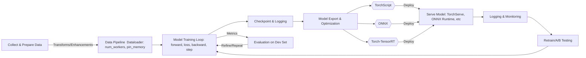

ChatGPT Deep research: give me a tech report on PyTorch, including core abstractions, model training and tuning methods, machine learning pipeline integration and optimization.

# PyTorch Technical Report

## Executive Summary  
PyTorch is a dynamic deep learning framework centered on **Tensors** (n-dimensional arrays) and **autograd** (automatic differentiation).  Its core model abstraction is the `torch.nn.Module`, whose `Parameter` attributes represent learnable weights.  A rich ecosystem of APIs supports model building (optimizers, loss functions), data handling (`Dataset`, `DataLoader`, `Sampler`, `Transform`), device management (`torch.device`, CUDA, XPU), and deployment (TorchScript, ONNX, TensorRT).  PyTorch’s design emphasizes flexibility (eager execution) and performance (accelerator support, JIT compilation, distributed training).  

This report analyzes PyTorch’s abstractions, training and tuning methods, and deployment pipeline.  We cover best practices (e.g. using `DataLoader` with multi-workers and pinning for throughput【41†L145-L150】, using mixed precision with `torch.amp` for speed/efficiency【52†L13-L21】【51†L15-L20】, and deterministic settings for reproducibility【83†L1-L9】【84†L7-L10】).  We compare distributed strategies (DDP, FSDP, ZeRO) and compiler/runtime options (TorchScript vs ONNX vs Torch-TensorRT) in tables below.  A mermaid diagram summarizes a typical training-to-deployment workflow.  Actionable recommendations are given for engineers to optimize PyTorch pipelines under no hardware constraints.

## Core Abstractions  
- **Tensors and Autograd:** PyTorch’s fundamental data structure is the `torch.Tensor`, similar to a NumPy array but supporting GPU/accelerator memory and gradient tracking.  All tensor operations build a dynamic computation graph: during the forward pass, PyTorch records operations, and on `loss.backward()`, it automatically computes gradients via backpropagation.  Users generally call `optimizer.step()` to update `Parameter` tensors using these gradients.  The dynamic (define-by-run) nature of autograd makes debugging intuitive and allows Python control flow in models.  

- **Neural Modules:** Models are defined as subclasses of `torch.nn.Module`.  Each `Module` can contain layers (e.g. `nn.Linear`, `nn.Conv2d`) as sub-modules and implements a `forward()` method.  Trainable weights are stored as `nn.Parameter`, a subclass of `Tensor` that is automatically added to the model’s parameter list.  For example:  

    ```python
    class MyModel(nn.Module):
        def __init__(self):
            super().__init__()
            self.fc = nn.Linear(128, 10)  # Parameter weights created
        def forward(self, x):
            return self.fc(x)
    model = MyModel().to(device)
    ```
  
- **Optimizers:** PyTorch provides standard optimizers in `torch.optim` (SGD, Adam, RMSprop, etc.), which update model parameters.  Each optimizer maintains per-parameter state (e.g. momentum buffers, Adam’s running averages).  Importantly, optimizers implement *decoupled* weight decay (e.g. `AdamW`) so that weight decay does not interfere with momentum/variance【62†L49-L58】.  I.e., setting `weight_decay` in AdamW applies a direct L2-like penalty to parameters, rather than accumulating in the gradient updates【62†L49-L58】.  

- **Data Pipeline:** Data is fed via `torch.utils.data.Dataset` (representing a dataset or custom sample collection) and `DataLoader` (loads batches).  A `Sampler` can customize which indices are drawn each epoch (e.g. `RandomSampler`, `DistributedSampler`).  Transforms (often from `torchvision.transforms`) can preprocess data on-the-fly.  The `DataLoader` handles batching, shuffling, and parallel loading.  Key optimizations: use `num_workers>0` for CPU parallelism in data loading (2–4 workers/GPU is a good start) and `pin_memory=True` when using CUDA【41†L145-L150】.  As shown in PyTorch documentation, raising `num_workers` (and `prefetch_factor`) can dramatically improve throughput (e.g. 3× speedup)【41†L43-L47】【41†L54-L62】.  Workers can be made *persistent* (`persistent_workers=True`) to reduce epoch startup overhead【42†L1-L6】.  DataLoader uses shared memory (`/dev/shm`) to transfer CPU tensors to GPU, so careful tuning of workers and shared-memory limits is advised【41†L43-L47】.  

- **JIT (TorchScript):** For deployment, PyTorch can export models to a static graph via **TorchScript**.  There are two modes: *tracing* and *scripting*【37†L122-L131】.  Tracing (`torch.jit.trace`) records tensor operations on given example inputs, which is simple but cannot capture dynamic control flow.  Scripting (`torch.jit.script`) compiles Python code into TorchScript, handling loops and conditionals, but requires code to conform to TorchScript subset.  TorchScript produces a serialized IR (Intermediate Representation) of the model that can be loaded in Python or in C++ (LibTorch)【37†L170-L179】.  TorchScript models can run with PyTorch’s JIT compiler for optimization, and they can be saved/loaded from disk.  However, as one PyTorch tutorial warns, traced graphs can be silently incorrect if the control flow depends on input values, whereas scripting enforces supported code patterns【25†L1-L4】.  

- **On-Device and Accelerator Support:** Tensors can be moved to devices via `tensor.to(device)` or `tensor.cuda()`.  PyTorch supports CUDA, ROCm (via AMD `torch.mps`), Intel GPUs (`torch.xpu`), Apple Silicon (`torch.backends.mps`), and CPU.  Internally, PyTorch manages GPU memory via a caching allocator to reduce `cudaMalloc` overhead【11†L35-L44】.  Users can query memory usage (e.g. `torch.cuda.memory_allocated()`) and free cache with `torch.cuda.empty_cache()`.  Mixed precision (`float16`, `bfloat16`) is natively supported: by default, tensors are 32-bit float, but autograd and CUDA allow lower precision for speed.

- **Distributed APIs:** PyTorch supports distributed and parallel training.  The main class is `torch.nn.parallel.DistributedDataParallel` (DDP), which replicates a model on each process/GPU and synchronizes gradients via all-reduce after each backward pass.  This synchronous data-parallelism is easy to use and scales across GPUs, nodes, and even machines【70†L7-L15】.  For large models, **Fully Sharded Data Parallel** (FSDP) shards parameters, gradients, and optimizer state across GPUs, reducing memory footprint.  FSDP auto-wraps modules and allgathers parameters only when needed, achieving significant memory reduction (e.g. ~30% lower peak memory vs naive DDP)【16†L679-L688】【16†L767-L771】.  Another strategy is **ZeRO** (via `torch.distributed.optim.ZeroRedundancyOptimizer`), which shards the *optimizer state only* across processes.  In DDP, each process holds a full copy of optimizer momentum and variance buffers (leading to ~2× model-size memory)【19†L418-L427】.  ZeRO partitions these buffers so each process only holds a shard, dramatically reducing memory per GPU【19†L418-L427】 (effectively “zero redundancy” in optimizer memory).  Table 1 (below) compares DDP, FSDP, and ZeRO in more detail.  

- **Memory Management:** PyTorch uses lazy GPU memory allocation and caching.  Unused GPU memory is not automatically returned to the OS; use `torch.cuda.empty_cache()` to clear Python-held caches.  The `pin_memory` flag allocates CPU tensors in page-locked memory to speed GPU transfers.  Mixed CPU/GPU training (e.g. swapping, offloading) is supported via `torch.distributed.fsdp.shard_grad_offload` and similar flags.  Profiling tools (`torch.profiler`) help identify memory bottlenecks.  Ensuring deterministic behavior may require `torch.backends.cudnn.deterministic=True` and `torch.use_deterministic_algorithms(True)`【84†L7-L10】.  

| Feature                    | DDP                                            | FSDP (Fully-Sharded DP)                                     | ZeRO (ZeroRedundancy Optimizer)          |
| -------------------------- | ---------------------------------------------- | ----------------------------------------------------------- | ---------------------------------------- |
| **Model Replicas**         | Full copy on each GPU                          | Sharded across GPUs                                         | Full copy (normally used with DDP)       |
| **Optimizer State**        | Full copy (per GPU)                            | Sharded across GPUs                                         | Sharded across processes【19†L418-L427】 |
| **Gradient Sync**          | All-reduce every backward                      | All-gather each layer’s grads (w/ overlap)                  | All-reduce (as in DDP)                   |
| **Memory Footprint**       | ~2× model (params + opt state)【19†L418-L427】 | ~1× model (significantly lower)                             | ~1× model (reduces optimizer state)      |
| **Communication Overhead** | High all-reduce bandwidth                      | More frequent smaller all-gathers                           | Similar to DDP for gradients             |
| **Use Case**               | General data-parallel (small/medium models)    | Very large models (e.g. billions of params)【16†L679-L688】 | When optimizer memory is bottleneck      |
| **PyTorch Support**        | Official, simple API                           | Official (`torch.distributed.fsdp`)                         | Official (`ZeroRedundancyOptimizer`)     |

*Table 1: Comparison of distributed training strategies. FSDP and ZeRO are advanced methods to reduce per-GPU memory usage, at the cost of additional communication or complexity. A reduction in memory allows training larger models or larger batch sizes per device【16†L679-L688】【19†L418-L427】.*

## Model Training and Tuning  
- **Training Loop:** A typical PyTorch training loop is explicit: iterate over `DataLoader` batches, move inputs to the device, compute `outputs = model(inputs)`, compute `loss = loss_fn(outputs, targets)`, call `loss.backward()`, then `optimizer.step()`, and finally `optimizer.zero_grad()`.  Users can flexibly insert custom logging or metric computation between these steps.  For example:

    ```python
    for epoch in range(epochs):
        for batch in train_loader:
            x, y = batch
            x, y = x.to(device), y.to(device)
            preds = model(x)
            loss = criterion(preds, y)
            loss.backward()
            # optional gradient clipping here
            optimizer.step()
            optimizer.zero_grad()
    ```

  Frameworks or higher-level libraries (Lightning, Ignite) automate boilerplate, but custom loops offer full control for gradient accumulation, custom schedulers, etc.  Use of `model.train()` vs `model.eval()` correctly toggles dropout/batchnorm behaviors.  

- **Losses and Metrics:** PyTorch’s `torch.nn` and `torch.nn.functional` provide common loss functions (`CrossEntropyLoss`, `MSELoss`, etc.) and activation functions.  Computing performance metrics (accuracy, F1, etc.) is typically done in Python using tensor comparisons, or with libraries like TorchMetrics.  It’s best to detach or move tensors to CPU before logging to avoid memory leaks.  

- **Gradient Handling:** 
  - **Accumulation:** To simulate larger batches, accumulate gradients over multiple mini-batches by calling `loss.backward()` multiple times before `optimizer.step()`. E.g., call `optimizer.step()` only every *k* batches and multiply the loss by `1/k` to average.  
  - **Clipping:** To stabilize training (especially RNNs), clip gradients via `torch.nn.utils.clip_grad_norm_(model.parameters(), max_norm)` after `loss.backward()` but before `optimizer.step()`. This prevents exploding gradients (no citation, but a common best practice).  
  - **Zeroing Gradients:** Always set gradients to zero with `optimizer.zero_grad()` or `model.zero_grad()` at the start of each iteration to avoid accumulation from previous batches.  

- **Mixed Precision (AMP):** PyTorch’s automatic mixed precision (AMP) allows training with float16 for speed/memory gains.  The typical pattern is using `with torch.autocast(device_type="cuda", dtype=torch.float16): ...` around the forward pass, and using `torch.amp.GradScaler` to scale loss values【52†L13-L21】【51†L15-L20】.  For example:  

    ```python
    scaler = torch.amp.GradScaler()
    for x,y in train_loader:
        optimizer.zero_grad()
        with torch.autocast(device_type="cuda", dtype=torch.float16):
            pred = model(x)
            loss = loss_fn(pred, y)
        scaler.scale(loss).backward()
        scaler.step(optimizer)
        scaler.update()
    ```
  
  This wraps operations so that most matrix-multiplication ops run in FP16 while critical ops (like certain reductions) remain in FP32【52†L13-L21】.  AMP typically yields 1.5–3× speedup on GPUs without manual code changes.  The `GradScaler` prevents small gradients from underflowing to zero【51†L15-L20】.  (If using PyTorch’s `torch.compile`/Dynamo, AMP can also be enabled there.)  

- **Learning Rate Scheduling:** Use `torch.optim.lr_scheduler` to adjust learning rates over epochs or iterations.  Common schedulers include `StepLR`, `CosineAnnealingLR`, or more advanced ones (OneCycle, ReduceLROnPlateau).  The scheduler’s step is usually called each epoch or batch depending on type.  Print or log learning rates for debugging.  

- **Weight Decay vs L2 Regularization:** In PyTorch optimizers, `weight_decay` typically implements L2 regularization.  For optimizers like SGD, weight decay and L2 penalty are equivalent.  For Adam, PyTorch’s `AdamW` uses decoupled weight decay (see above), which is generally preferable.  In practice, set `weight_decay` in the optimizer (e.g. `optim.AdamW(model.parameters(), lr=..., weight_decay=1e-4)`) rather than manually adding `loss += λ||w||^2`.  

- **Regularization:** Besides weight decay, use dropout (`nn.Dropout`) to randomly zero activations during training.  Dropout “has proven to be an effective technique for regularization and preventing the co-adaptation of neurons”【66†L1-L4】.  Early stopping, data augmentation, and batch normalization are also common regularizers.  

- **Checkpointing:** Save model and optimizer state with `torch.save()` to files (usually via `model.state_dict()` and `optimizer.state_dict()`).  This allows resuming training or performing inference later.  It’s recommended to checkpoint regularly (each epoch or after fixed iterations).  PyTorch’s built-in serialization (`torch.save`) efficiently handles large models.  Also consider Torch’s newer `torch.distributed.checkpoint` for sharded checkpoints in FSDP.  

- **Reproducibility:** For consistent results, fix random seeds (`torch.manual_seed`, `numpy.random.seed`, and `random.seed` in Python).  PyTorch docs advise using `torch.manual_seed(0)` at program start【83†L1-L9】.  Also set `torch.backends.cudnn.deterministic = True` and optionally `torch.use_deterministic_algorithms(True)` to ensure CUDA algorithms do not nondeterministically reorder work【84†L7-L10】.  Note: full reproducibility may be impossible if using some asynchronous GPU operations or nondeterministic math.  

- **Profiling and Debugging:** Use `torch.autograd.set_detect_anomaly(True)` to catch NaNs/Inf in backward.  For performance, use `torch.profiler` (formerly `torch.autograd.profiler` or external tools like TensorBoard/PyTorch Profiler UI).  The profiler can sample GPU/CPU time and memory to pinpoint bottlenecks.  PyTorch developer notes and tutorials cover profiling in detail.  In code, print tensor shapes or use `print(model)` to verify architecture.  Tools like TorchScript and DXLiTe (torch.compile) also often provide error messages if an unsupported operation is encountered.  

- **Common Pitfalls:** Forgetting `optimizer.zero_grad()` causes gradient accumulation across batches.  Using PyTorch data structures off GPU inadvertently can slow training.  Unintended non-determinism (e.g. using `permute` randomly on GPU) can make debugging hard.  Over- or under-parallelizing the DataLoader (`num_workers` too high causing memory thrash) is a common issue【41†L43-L47】.  Not handling `find_unused_parameters` in DDP can lead to errors if model branches skip parameters【70†L43-L51】.  

## ML Pipeline Integration and Optimization  

- **Data Pipeline Performance:** Beyond the basic DataLoader, use *prefetching* by combining multiple workers (`num_workers > 0`) and `pin_memory=True`【41†L145-L150】.  PyTorch’s data loading tutorial recommends starting with 2–4 workers per GPU and tuning: “increase workers until throughput plateaus. Too many workers waste CPU memory (each holds a copy of the dataset and prefetched batches) and can cause `/dev/shm` exhaustion. A good starting point is 2-4 workers per GPU”【41†L43-L47】.  For heavy image augmentations or decoding, third-party libraries like NVIDIA DALI can further speed up preprocessing by offloading to CPU/GPU.  

- **Distributed Training Strategies:**  (Refer back to Table 1.)  In summary, DDP is the standard choice for data-parallel training.  For extremely large models that exceed single-GPU memory, use FSDP with CPU or NVMe offloading of parameters or optimizer state (so parameters not needed in memory).  ZeRO (ZeroRedundancyOptimizer) can be combined with DDP to shard optimizer state and is particularly useful in multi-GPU training where optimizer state (e.g. in Adam) is a bottleneck【19†L418-L427】.  

- **Mixed Precision and Accelerators:** AMP is discussed above; additionally, the new `torch.compile` (TorchDynamo + Inductor) enables just-in-time compilation of models for CPUs/GPUs, often yielding performance gains over eager, though with longer initial compilation time【25†L1-L4】.  For CPU-specific optimizations, the Intel Extension for PyTorch and Apple’s `torch.backends.mps` for Metal can be used.  For TPUs (on Google Cloud) or AWS Trainium/Inferentia, PyTorch has XLA backends (TorchXLA, PyTorch Neuron).  

- **Model Export (TorchScript, ONNX, TensorRT):**  
    - **TorchScript:** Converts PyTorch models to a static graph.  Use `torch.jit.trace(model, example_input)` or `torch.jit.script(model)`.  This produces a serialized module (.pt or .ts file) that can be loaded with `torch.jit.load` in Python or C++.  Good for deploying in PyTorch’s C++ runtime or on mobile devices.  However, TorchScript is PyTorch-specific and may require code adjustments.  
    - **ONNX:** PyTorch can export models to the ONNX format via `torch.onnx.export`.  ONNX is an open standard that allows running models on various runtimes (ONNX Runtime, TensorRT, TensorFlow, etc.).  According to PyTorch, “ONNX is a flexible open standard format for representing machine learning models” that enables execution across hardware from data centers to edge devices【35†L417-L425】.  Since PyTorch 2.5, the exporter uses FX/dynamo by default.  ONNX covers most common ops, but very custom or control-flow-heavy models may require workarounds.  Benefits: broad portability and optimization (e.g. ONNX Runtime has its own graph optimizations).  
    - **Torch-TensorRT:** An NVIDIA-supported compiler that integrates PyTorch with TensorRT.  It can be used via `torch.compile(model, backend="tensorrt")` or `torch_tensorrt.compile`, producing an optimized module that runs on NVIDIA GPUs【21†L33-L41】.  The documentation notes: “Torch-TensorRT compiles PyTorch models for NVIDIA GPUs using TensorRT, delivering significant inference speedups with minimal code changes. It supports just-in-time compilation via `torch.compile` and ahead-of-time export via `torch.export`【21†L33-L41】.”  Torch-TensorRT is ideal when maximizing NVIDIA GPU inference performance, but it’s hardware-specific.  The output can be a TorchScript module (via `.save(..., output_format="torchscript")`) for C++ deployment【21†L79-L87】.  

| Feature              | TorchScript                                                              | ONNX                                                                               | Torch-TensorRT                                                       |
| -------------------- | ------------------------------------------------------------------------ | ---------------------------------------------------------------------------------- | -------------------------------------------------------------------- |
| **Definition**       | PyTorch’s JIT IR (trace/script)【37†L50-L58】                            | Open Neural Network Exchange (standard graph)【35†L417-L425】                      | PyTorch compiler for NVIDIA (uses TensorRT)【21†L33-L41】            |
| **Export API**       | `torch.jit.trace`/`script`, produces `.pt`/`.ts`                         | `torch.onnx.export(model, ..., opset=...)`                                         | `torch_tensorrt.compile` or `torch.compile(..., backend="tensorrt")` |
| **Execution**        | Via PyTorch JIT (C++/Python runtime)                                     | Via ONNX Runtime, or other ONNX-supported runtimes (TensorRT, TensorFlow, etc.)    | Via PyTorch runtime leveraging TensorRT kernels (requires NVIDIA)    |
| **Dynamic Control**  | Script mode supports Python control flow; trace does not【37†L122-L131】 | Models with control flow require static modes; some loops/unrolled ops supported   | Limited by TensorRT’s support; often best for feed-forward ops       |
| **Hardware Support** | Any PyTorch-supported device; mobile (Android, iOS) with LibTorch        | Any (CPU, GPU, specialized) backend with ONNX runtime                              | NVIDIA GPUs only (leverages TensorRT)                                |
| **Performance**      | Generally similar to eager; can improve for C++ inference and mobile     | Depends on ONNX runtime; often highly optimized (e.g. TensorRT, OpenVINO backends) | Up to ~5× speedup on inference vs eager PyTorch【21†L33-L41】        |
| **Use Cases**        | Deploying PyTorch models in C++/mobile; static analysis                  | Cross-framework deployment (e.g. PyTorch→TensorRT via ONNX); research              | High-performance NVIDIA inference with minimal code changes          |
| **Pros/Cons**        | ✅ Full PyTorch support. ❌ Requires code conversion.                      | ✅ Portable, many runtimes. ❌ May not support all PyTorch ops.                      | ✅ Max NVIDIA perf. ❌ Hardware-specific.                              |

*Table 2: Comparison of model export and optimization strategies. TorchScript stays within the PyTorch ecosystem, ONNX is cross-platform, and Torch-TensorRT targets NVIDIA GPU acceleration【21†L33-L41】【35†L417-L425】.*  

- **Quantization and Pruning:** PyTorch supports model quantization (converting weights/activations to INT8 or FP16) to reduce size and increase inference speed.  Options include *post-training quantization* (static/dynamic) and *quantization-aware training* using `torch.quantization`.  Quantized models can often run on CPU/GPU with no retraining (just calibration) for smaller models.  Pruning (via `torch.nn.utils.prune`) can remove unimportant weights to yield sparse models.  These techniques trade slight accuracy loss for efficiency.  For example, PyTorch’s documentation and recent tutorials (2023–2025) showcase static quantization flows that significantly reduce model size.  

- **Model Serving (TorchServe):** For production deployment, **TorchServe** is the official PyTorch model server.  As AWS notes, TorchServe “is the recommended model server for PyTorch, preinstalled in the AWS PyTorch DLC” and offers high performance on CPU/GPU/other instances【73†L15-L23】.  It supports dynamic batching, multi-model endpoints, A/B testing of models, and features like configurable handlers, metrics, and logging.  (Note: TorchServe’s GitHub now marks it “limited maintenance,” but it is widely used.)  TorchServe can serve models saved in TorchScript or as PyTorch archives (`.mar` files) and integrate with AWS Sagemaker, Google Vertex, etc.  

- **Distributed Inference and Model Parallel:** For very large models or ensemble deployments, PyTorch supports RPC for model-parallel patterns.  The `torch.distributed.rpc` framework allows executing parts of a model on different processes.  Pipeline parallelism (via `torch.distributed.pipeline.sync.Pipe`) splits layers across GPUs.  These are advanced features usually combined with DDP/FSDP for training.  

- **CI/CD and Monitoring:** In production ML systems, best practices include versioning models (with DVC or torch.package), continuous integration tests (e.g. unit tests of data pipelines and training loops), and continuous monitoring of deployed models (latency, throughput, accuracy drift).  Tools like TorchMonitor (`torch.monitor`), or third-party monitoring (Prometheus, Datadog) can track GPU utilization and inference stats.  A/B testing or canary deployment is recommended for new models.  PyTorch models packaged via `torch.package` or TorchServe artifacts can be integrated into Docker/Kubernetes pipelines for reproducible deployment.  

## Best Practices, Code Examples, and Pitfalls  

- **DataLoader Tips:** Benchmark different `num_workers` and `pin_memory` settings. A common recipe: 

    ```python
    loader = DataLoader(dataset, batch_size=64, shuffle=True,
                        num_workers=4, pin_memory=True)
    ```

  If your data transforms are simple tensor ops, fewer workers (even 0) might suffice; if heavy (image decoding, augmentation), use more workers and consider NVIDIA DALI or caching.  If encountering OOM in `/dev/shm`, lower `prefetch_factor` or `num_workers`【41†L43-L47】.  

- **Device Placement:** Always move models and data to the same device (e.g. `model.cuda()`, `tensor.cuda()`).  Avoid unintentionally mixing CPU and GPU tensors, which causes implicit copying or errors.  Use `device = torch.device("cuda" if torch.cuda.is_available() else "cpu")` at start, then `.to(device)` consistently.  

- **AMP Usage:** As shown above, wrap the forward pass with `torch.autocast` for mixed precision.  Ensure to move loss and gradients via `scaler`.  For inference only, `autocast` can be used without `GradScaler` (no backward pass), giving faster inference【52†L13-L21】.  

- **Checkpointing Best Practices:** Save both `model.state_dict()` and `optimizer.state_dict()`.  For DDP, use `model.module.state_dict()` (since DDP wraps the model).  When resuming, remember to call `optimizer.load_state_dict()` **before** continuing training.  Example:

    ```python
    torch.save({'epoch': epoch,
                'model_state': model.state_dict(),
                'optim_state': optimizer.state_dict()},
               'checkpoint.pth')
    # Later...
    cp = torch.load('checkpoint.pth')
    model.load_state_dict(cp['model_state'])
    optimizer.load_state_dict(cp['optim_state'])
    ```

- **Profiling Checklist:** If training is slow or out-of-memory, check: 
    - CPU usage (DataLoader bottleneck?); 
    - GPU utilization (are kernels launched?); 
    - Data transfer (is `pin_memory` used?);
    - Layer shape compatibilities (inefficient formats like NHWC vs NCHW on CUDA? Use channels-last format if beneficial).  
  Use `nvprof`/`nsys` or `torch.profiler` to get timing breakdown.  PyTorch’s summaries (enable `TORCH_DISTRIBUTED_DEBUG=DETAIL`) can also show DDP overhead per iteration.  

- **Avoiding NaNs and Exploding Gradients:** If training diverges, try lower learning rate, gradient clipping, or switching from SGD to AdamW (or vice versa).  Check that no divisions by zero occur in the model or loss.  If using AMP, watch for uncontrolled over/underflows.  Use `torch.autograd.detect_anomaly(True)` to find the operation that produced NaNs in backward.  

- **Performance Tuning Checklist:**  
  1. **Batch Size:** Increase until GPU memory is ~80–90% used, to maximize utilization (larger batch = more parallelism).  
  2. **Model Precision:** Use FP16/AMP on GPUs for speed/memory (or bfloat16 on TPUs).  
  3. **Data Throughput:** Tune `num_workers`, `prefetch_factor`, `pin_memory` as per DataLoader guide【41†L145-L150】.  
  4. **Memory Formats:** Consider `model.to(memory_format=torch.channels_last)` for conv nets on GPU to improve cache/locality.  
  5. **Parallelism:** For multi-GPU, prefer DDP over DataParallel. Use Apex/FSDP/ZeRO if memory limits are hit.  Use `torch.distributed.launch` or `torchrun` to manage processes.  
  6. **Environment:** Use latest CUDA/cuDNN/PyTorch for best kernel performance.  Compile with MKL-DNN for CPU.  
  7. **Inference:** Export to TorchScript or ONNX for faster inference.  Apply quantization or TensorRT as needed.



*Figure: Typical PyTorch training-to-deployment pipeline, from data ingestion through training, model export, serving, and feedback for retraining (represented in Mermaid flowchart).*

## Conclusions and Recommendations  
PyTorch offers a comprehensive, flexible toolkit for deep learning.  Its core abstractions (Tensors, autograd, `nn.Module`) let engineers prototype quickly, while advanced APIs (AMP, JIT, distributed) provide production-scale performance.  Key recommendations: 

- **Optimize Data Loading:** Always batch and parallelize data input. Start with 2–4 `num_workers` and `pin_memory=True`【41†L145-L150】. Consider DALI or caching datasets to speed I/O.  
- **Leverage AMP:** Use automatic mixed precision to accelerate training on modern GPUs【52†L13-L21】【51†L15-L20】. It often yields large speedups with minimal code changes.  
- **Choose the Right Parallelism:** Use DDP for standard training; switch to FSDP or ZeRO when model/optimizer size hits limits【19†L418-L427】【16†L679-L688】.  Profile memory and communication to decide.  
- **Use Profiler Early:** Integrate `torch.profiler` in your code to catch bottlenecks and ensure hardware is fully utilized.  
- **Export for Inference:** For deployment, export models to a static format.  TorchScript is seamless for Python/C++ inference, ONNX for cross-platform, and Torch-TensorRT for maximal NVIDIA speed【21†L33-L41】【35†L417-L425】.  Test the exported model thoroughly.  
- **Ensure Reproducibility:** Fix seeds (`torch.manual_seed`) and use deterministic algorithms when needed【83†L1-L9】【84†L7-L10】.  Log hyperparameters and use `torch.utils.checkpoint` for reproducible checkpointing.  
- **Monitoring and MLOps:** Instrument training and serving with logs and metrics.  Integrate with CI/CD and model versioning.  PyTorch’s ecosystem (TorchServe, Ray, Kubeflow integrations) offers various solutions.

By following these guidelines, engineers can build efficient, scalable PyTorch pipelines. Keeping PyTorch updated and leveraging its community resources will ensure best results.  

**Sources:** Official PyTorch documentation and tutorials【41†L145-L150】【52†L13-L21】【35†L417-L425】【73†L15-L23】【21†L33-L41】【19†L418-L427】, recent PyTorch tutorials and deployment guides.


- 1/7/8/9: [Data Loading Optimization in PyTorch — PyTorch Tutorials 2.12.0+cu130 documentation](https://docs.pytorch.org/tutorials/intermediate/intermediate_data_loading_tutorial.html)
- 2/3: [Automatic Mixed Precision — PyTorch Tutorials 2.12.0+cu130 documentation](https://docs.pytorch.org/tutorials/recipes/recipes/amp_recipe.html)
- 4/5: [Reproducibility — PyTorch 2.12 documentation](https://docs.pytorch.org/docs/2.12/notes/randomness.html)
- 6: [torch.optim — PyTorch 2.12 documentation](https://docs.pytorch.org/docs/2.12/optim.html)
- 10/11/23: [Creating a TorchScript Module — Torch-TensorRT](https://docs.pytorch.org/TensorRT/ts/creating_torchscript_module_in_python.html)
- 12: [Introduction to torch.compile — PyTorch Tutorials 2.12.0+cu130 documentation](https://docs.pytorch.org/tutorials/intermediate/torch_compile_tutorial.html)
- 13: [Understanding CUDA Memory Usage — PyTorch 2.12 documentation](https://docs.pytorch.org/docs/2.12/torch_cuda_memory.html)
- 14/19: [Distributed communication package - torch.distributed — PyTorch 2.12 documentation](https://docs.pytorch.org/docs/2.12/distributed.html)
- 15/16: [Getting Started with Fully Sharded Data Parallel(FSDP) — PyTorch Tutorials 2.12.0+cu130 documentation](https://docs.pytorch.org/tutorials/intermediate/FSDP1_tutorial.html)
- 17: [Shard Optimizer States with ZeroRedundancyOptimizer — PyTorch Tutorials 2.12.0+cu130 documentation](https://docs.pytorch.org/tutorials/recipes/zero_redundancy_optimizer.html)
- 18: [Dropout — PyTorch 2.12 documentation](https://docs.pytorch.org/docs/2.12/generated/torch.nn.Dropout.html)
- 20: [Export a PyTorch model to ONNX — PyTorch Tutorials 2.12.0+cu130 documentation](https://docs.pytorch.org/tutorials/beginner/onnx/export_simple_model_to_onnx_tutorial.html)
- 21/22: [Torch-TensorRT — Torch-TensorRT](https://docs.pytorch.org/TensorRT/)
- 24: [Deploy models with TorchServe - Amazon SageMaker AI](https://docs.aws.amazon.com/sagemaker/latest/dg/deploy-models-frameworks-torchserve.html)