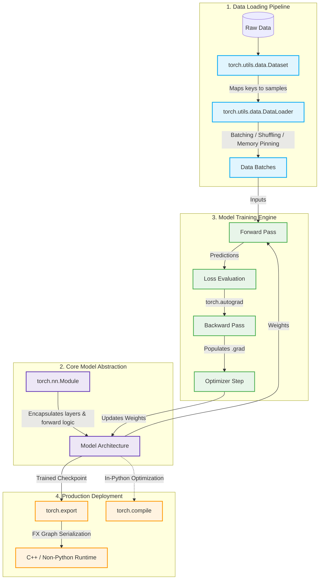
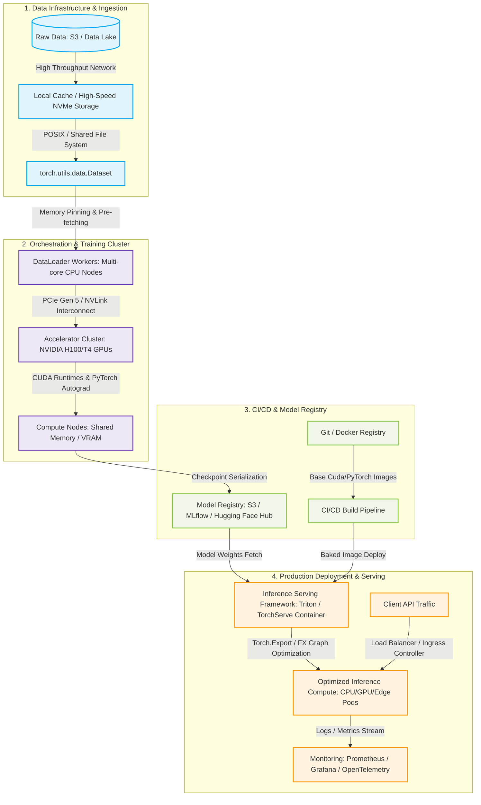

# PyTorch
* https://pytorch.org/
* code: https://github.com/pytorch/pytorch

> PyTorch is a Python package that provides two high-level features:
>
> - Tensor computation (like NumPy) with strong GPU acceleration/GPU加速的张量计算
> - Deep neural networks built on a tape-based autograd system/基于磁带的自动求导系统上的深度神经网络
>
> You can reuse your favorite Python packages such as NumPy, SciPy, and Cython to extend PyTorch when needed.


```shell
$ pip install torch torchvision torchaudio


>>> import torch
>>> torch.__version__
'2.12.0+cpu'
```

# Architecture

- PyTorch packages perspective


- IT Infrastructure perspective


# Python API
* https://docs.pytorch.org/docs/2.12/pytorch-api.html

## Summary
- Modeling, Layers & Training Components/建模,层和训练组件

| Package / Item Name       | Description                                                                                                                                         |
| ------------------------- | --------------------------------------------------------------------------------------------------------------------------------------------------- |
| `torch.nn`                | The fundamental building blocks of neural networks, containing stateful layers (Linear, Conv), loss functions, and structural containers.           |
| ├── `torch.nn.functional` | Stateless functional operators (typically imported as `F`) for activations (ReLU, Sigmoid), pooling, and layers without trainable weights.          |
| ├── `torch.nn.init`       | Weight and bias initialization strategies (e.g., Kaiming, Xavier/Glorot) for network parameters.                                                    |
| └── `torch.nn.attention`  | PyTorch 2.x Core Feature: Advanced attention primitives, containing highly optimized implementations like FlashAttention and FlexAttention.         |
| `torch.amp`               | Automatic Mixed Precision module. Speeds up training and reduces VRAM footprint by automatically casting operations between FP16/BF16 and FP32.     |
| `torch.autograd`          | The core automatic differentiation engine implementing the dynamic, tape-based computation graph system.                                            |
| `torch.optim`             | Standard optimization algorithms (SGD, Adam, AdamW) and learning rate scheduling techniques.                                                        |
| `Quantization`            | API for model quantization, enabling FP32 models to be converted into lower precision formats (like INT8) for efficient edge and mobile deployment. |

- Tensor Attributes, Views & Data Layouts/张量属性, 视图和数据布局

| Package / Item Name               | Description                                                                                                                                            |
| --------------------------------- | ------------------------------------------------------------------------------------------------------------------------------------------------------ |
| `Tensor Attributes`               | Interfaces for retrieving a tensor's three core properties: its data type (`dtype`), physical compute device (`device`), and memory layout (`layout`). |
| `Tensor Views`                    | Internal mechanism handling tensor resizing or stride restructuring without triggering a deep physical copy of the underlying memory.                  |
| `Complex Numbers`                 | Native support for complex-valued tensors (real and imaginary parts), commonly used in signal processing and quantum computing architectures.          |
| `Type Info`                       | Classes (`finfo` for floating point, `iinfo` for integers) to query machine limits, precision bounds, and numerical extremums.                         |
| `Named Tensors`                   | Allows dimensions to be explicitly tagged with names (e.g., `['N', 'C', 'H', 'W']`), preventing dimension alignment bugs and improving legibility.     |
| `Named Tensors operator coverage` | A matrix registry specifying which native PyTorch operators officially support and propagate the Named Tensor naming structure.                        |
| `torch.Size`                      | A specialized class subclassing standard Python tuples, used exclusively to represent and manipulate tensor shapes.                                    |
| `torch.Storage`                   | The low-level interface managing raw, contiguous byte allocations that store the physical data of a tensor.                                            |

- Hardware Devices, Accelerators & Compute Backends/硬件设备, 加速器和计算后端

| Package / Item Name         | Description                                                                                                                                                                  |
| --------------------------- | ---------------------------------------------------------------------------------------------------------------------------------------------------------------------------- |
| `torch.accelerator`         | New in PyTorch 2.12: A unified, device-agnostic API designed to orchestrate stream management and graph capture seamlessly across different hardware vendors.                |
| `torch.cpu`                 | Central processing unit management package, controlling multi-threading behaviors, thread affinity, and instruction-set-specific settings.                                   |
| `torch.cuda`                | Core library for managing NVIDIA GPU resources, asynchronous compute streams, and hardware synchronization.                                                                  |
| └── `torch.cuda.memory`     | Specialized sub-utilities for tracking, profiling, allocating, and clearing NVIDIA graphics memory (VRAM).                                                                   |
| `torch.mps`                 | Interface for hardware-accelerated execution on Apple Silicon chips (M1/M2/M3/M4 families) via Apple's Metal Performance Shaders (MPS).                                      |
| `torch.xpu`                 | Dedicated hardware accelerator package for Intel graphics cards (supporting Data Center GPU Flex/Max series, etc.).                                                          |
| `torch.mtia`                | Device driver interface specifically built for Meta's custom AI chip architecture, the Meta Training and Inference Accelerator.                                              |
| ├── `torch.mtia.memory`     | Sub-package tailored for allocating and auditing on-chip and off-chip memory bounds within MTIA architectures.                                                               |
| └── `torch.mtia.mtia_graph` | Custom graph-capture optimization backend configured explicitly for the architectural features of MTIA chips.                                                                |
| `Meta device`               | A virtual hardware target. Tensors assigned to `meta` allocate no physical memory, carrying only shape and datatype bounds—ideal for zero-memory dry runs of massive models. |
| `torch.backends`            | Controls and feature switches for third-party low-level compute libraries (e.g., `cudnn`, `mkl`, `mkldnn`, `openmp`).                                                        |

- Advanced Compilation & Functional Programming (PyTorch 2.x Core)/高级编译和函数式编程

| Package / Item Name         | Description                                                                                                                                                    |
| --------------------------- | -------------------------------------------------------------------------------------------------------------------------------------------------------------- |
| `torch.compiler`            | The flagship module of PyTorch 2.x. Main gateway for transforming dynamic Python code into fused, highly optimized hardware kernels via `torch.compile()`.     |
| `torch.export`              | Modern static graph-capture pipeline designed to produce completely standalone graph formats for runtime execution outside of a Python interpreter.            |
| `torch.func`                | Composable functional programming transforms (JAX-inspired, formerly `functorch`), including vectorized maps (`vmap`), reverse/forward autodiff, and hessians. |
| `torch.fx`                  | Python-to-python symbolic graph tracer and rewriter, used for creating custom code analysis passes, graph fusions, and custom quantization pipelines.          |
| └── `torch.fx.experimental` | Incubation ground for next-generation FX graph features, structural patches, and advanced dynamic shape handling.                                              |
| `torch.onnx`                | Interoperability module responsible for export and translation of PyTorch modules into the open standard Open Neural Network Exchange (ONNX) format.           |

- Specialized Mathematics & Advanced Tensors/特殊数学和高级张量

| Package / Item Name   | Description                                                                                                                                                |
| --------------------- | ---------------------------------------------------------------------------------------------------------------------------------------------------------- |
| `torch.fft`           | High-performance Fast Fourier Transform operators providing 1D, 2D, and N-dimensional forward/inverse spectral analysis tools.                             |
| `torch.linalg`        | Industrial-grade linear algebra module supporting matrix factorization, eigenvalues (`eigh`), inverses, and Singular Value Decomposition (SVD).            |
| `torch.signal`        | Signal processing toolbox offering filtering primitives, windowing functions, and structural convolutions.                                                 |
| `torch.special`       | Specialized mathematical functions similar to SciPy (e.g., Gamma, Error functions, Bessel equations).                                                      |
| `torch.masked`        | Masked Tensor module. High-level APIs for executing safe, robust mathematical operations directly across arrays containing missing/masked values.          |
| `torch.nested`        | Nested Tensor module. Natively represents tensors where sub-sequences vary in length, eliminating the need for padding tokens in models like Transformers. |
| `torch.sparse`        | Framework supporting highly optimized storage layouts (e.g., CSR, COO) and compute routines for tensors dominated by zeroes.                               |
| `torch.distributions` | Broad library of probability distributions, parameterizable sampling pipelines, and log-likelihood calculation tools (`log_prob`).                         |

- Distributed Training & Massive-Scale Parallelism/分布式训练和大规模并行

| Package / Item Name                          | Description                                                                                                                                               |
| -------------------------------------------- | --------------------------------------------------------------------------------------------------------------------------------------------------------- |
| `torch.distributed`                          | The baseline multi-node/multi-GPU execution engine, providing collective communication primitives (AllReduce, Broadcast).                                 |
| ├── `torch.distributed.tensor`               | Distributed Tensor (DTensor). Low-level primitive handling global tensor sharding and cross-device placements across clustered clusters.                  |
| ├── `torch.distributed.algorithms.join`      | Joining hooks that solve data-imbalance hangs during distributed loops, allowing collective operations to finish gracefully when paths have uneven steps. |
| ├── `torch.distributed.elastic`              | TorchElastic (Elastic Training). Enables dynamic cluster auto-scaling, node failure fault-tolerance, and dynamic checkpoint reloading.                    |
| ├── `torch.distributed.fsdp`                 | Fully Sharded Data Parallel (FSDP). The industry standard for Large Language Model (LLM) training, sharding parameters, gradients, and optimizer states.  |
| ├── └── `torch.distributed.fsdp.fully_shard` | Core API method inside FSDP used to partition specific submodules across the distributed hardware grid.                                                   |
| ├── `torch.distributed.tensor.parallel`      | Tensor Parallelism (TP). Slices massive weight matrices (like Linear layers in a Transformer) horizontally or vertically across linked GPUs.              |
| ├── `torch.distributed.optim`                | Distributed optimizer abstractions that handle optimizer status syncs and param tracking over cluster nodes.                                              |
| ├── `torch.distributed.pipelining`           | Pipeline Parallelism (PP). Sections different layers of a model across sequential GPUs, processing mini-batches in an interleaved assembly line.          |
| ├── `torch.distributed._symmetric_memory`    | Low-level high-performance module: Bypasses traditional limits by creating symmetric memory windows via NVLink for extreme P2P GPU read/writes.           |
| └── `torch.distributed.checkpoint`           | Handles highly concurrent, asynchronous state saving and loading routines for ultra-large models (hundreds of billions of parameters).                    |
| `DDP Communication Hooks`                    | Extensible hooks inside Distributed Data Parallel allowing custom gradient communication codecs (like FP16 compression or PowerSGD).                      |
| `Distributed RPC Framework`                  | Remote Procedure Call architecture built to orchestrate complex, asymmetric network schemes like parameter servers or Reinforcement Learning actors.      |

- Diagnostics, Testing, Profiling & Extension Utilities/诊断, 测试和扩展工具

| Package / Item Name                      | Description                                                                                                                                                           |
| ---------------------------------------- | --------------------------------------------------------------------------------------------------------------------------------------------------------------------- |
| `torch.utils`                            | General utility container offering multiple helper scripts spanning the entire deep learning workflow lifecycle.                                                      |
| ├── `torch.utils.collect_env`            | System diagnosis utility that scans and outputs full operating system details, Python versions, CUDA setups, and PyTorch build metrics for debugging.                 |
| ├── `torch.utils.flop_counter`           | PyTorch 2.x Tool: A graph-level FLOPs (Floating Point Operations) calculator to audit the theoretical computational complexity of a module.                           |
| ├── `torch.utils.hipify.hipify_python`   | Translation engine that automates the migration of native NVIDIA CUDA C/C++ source code over to AMD's ROCm (HIP) framework.                                           |
| ├── `torch.utils.benchmark`              | High-precision benchmarking toolset that eliminates wall-clock measurement anomalies caused by Python warmups or OS noise.                                            |
| ├── ├── `torch.utils.benchmark.examples` | Pre-packaged reference scripts showcasing correct integration and profiling workflows for the benchmark module.                                                       |
| ├── └── `...spectral_ops_fuzz_test`      | Fuzz-testing module used to benchmark and check performance consistency of spectral/Fourier operations under randomized boundaries.                                   |
| ├── `torch.utils.checkpoint`             | Gradient Checkpointing. Trades compute for memory by dropping intermediate activations during forward loops and recalculating them on the fly during backward passes. |
| ├── `torch.utils.cpp_extension`          | C++ compiler and extension loader allowing developers to write raw C++/CUDA source files and import them directly into PyTorch scripts as modules.                    |
| ├── `torch.utils.data`                   | Data pipelining hub housing the abstract `Dataset` class and the multi-threaded data fetching/batching workflow engine `DataLoader`.                                  |
| ├── `torch.utils.deterministic`          | Configures global determinism modes to restrict variance in underlying compute backends (like cuDNN algorithms), ensuring 100% experiment reproducibility.            |
| ├── `torch.utils.jit`                    | Legacy JIT (TorchScript) compiler utility tools, primarily used for logging extraction and reading old serialized structures.                                         |
| ├── └── `torch.utils.jit.log_extract`    | Diagnostics tool to pull, clean, and isolate compiler execution graphs out of the TorchScript runtime log files.                                                      |
| ├── `torch.utils.dlpack`                 | DLPack compliance tensor interface. Enables direct, zero-copy tensor sharing across memory borders between PyTorch, NumPy, JAX, and MXNet.                            |
| ├── `torch.utils.mobile_optimizer`       | Script optimizing computational graphs specifically to align with target runtimes and battery constraints on mobile platforms.                                        |
| ├── `torch.utils.model_zoo`              | Legacy web caching wrapper designed to auto-fetch, save, and check integrity of remote pre-trained weights via a URL endpoint.                                        |
| ├── `torch.utils.tensorboard`            | Event-logger interface allowing developers to write losses, evaluation curves, weights, and model topology graphs over to a TensorBoard UI.                           |
| └── `torch.utils.module_tracker`         | New Monitoring Tool: Tracks, evaluates, and logs computational execution speed, memory peaks, and operational pathways of active `Module` objects.                    |
| `torch.testing`                          | Internal testing library providing rigorous validation asserts (like `assert_close` with custom tolerances) optimized for tensor floating point comparisons.          |
| `torch.profiler`                         | Full-scale execution profiler capable of capturing granular hardware-level timeline traces spanning CPU operator overhead and GPU kernel execution times.             |

- Ecosystem Management, Interops & Internal Infrastructure/生态系统管理, 互操作和内部基础设施

| Package / Item Name           | Description                                                                                                                                                                     |
| ----------------------------- | ------------------------------------------------------------------------------------------------------------------------------------------------------------------------------- |
| `torch.library`               | The primary extension registry enabling custom C++/CUDA operators to safely publish multi-hardware dispatch behaviors into PyTorch's unified runtime.                           |
| `torch.futures`               | Asynchronous execution primitives managing computational promises, highly utilized in concurrent RPC systems and multi-stream syncs.                                            |
| `torch.hub`                   | Minimalist code/model sharing portal allowing pre-built GitHub code repositories and pre-trained weights to be initialized via a single `torch.hub.load()` command.             |
| `torch.monitor`               | Instrumentation API designed to pipe long-running cluster health statistics and training velocity outputs straight out to system-level daemon trackers.                         |
| `torch.overrides`             | Low-level hooking infrastructure underlying protocols like `__torch_function__`, letting custom non-PyTorch array types integrate smoothly with standard `torch.*` ops.         |
| `torch.nativert`              | Lower-tier abstraction layer communicating directly with physical runtime execution bounds to enforce hardware state synchronization.                                           |
| `torch.package`               | Hermetic module compilation system. Packs model structures, weights, and underlying file dependencies into isolated bundles, completely preventing environment contamination.   |
| `torch.random`                | Global Random Number Generator (RNG) control center regulating random seed configurations across CPU, CUDA, and MPS targets simultaneously.                                     |
| `torch.__config__`            | Text metadata querying layer revealing exact low-level dependencies and compiler setups (such as BLAS type or C++ compiler version) used to compile the binary.                 |
| `torch.__future__`            | Structural gating flags used to enforce or evaluate next-generation API paradigm changes before they officially replace deprecated behaviors in later updates.                  |
| `torch._logging`              | PyTorch 2.x Compiler Infrastructure: Precision logger engine specifically managing internal diagnostic printouts of `torch.compile` passes (Dynamo, Inductor).                  |
| `Torch Environment Variables` | Global system configuration parameters governing low-level behavior, such as parallel CPU worker counts (`OMP_NUM_THREADS`) or active device mappings (`CUDA_VISIBLE_DEVICES`). |


- `torch.jit` is functionally legacy in the 2.12 lifestyle, with engineering teams routing static production graph compilations over to the modern `torch.export` package.


## torch.Tensor


| Name                                 | Description                                                                                                                                                                 |
| ------------------------------------ | --------------------------------------------------------------------------------------------------------------------------------------------------------------------------- |
| `new_tensor`                         | Returns a new Tensor with `data` as the tensor data.                                                                                                                        |
| `new_full`                           | Returns a Tensor of size `size` filled with `fill_value`.                                                                                                                   |
| `new_empty`                          | Returns a Tensor of size `size` filled with uninitialized data.                                                                                                             |
| `new_ones`                           | Returns a Tensor of size `size` filled with `1`.                                                                                                                            |
| `new_zeros`                          | Returns a Tensor of size `size` filled with `0`.                                                                                                                            |
| `is_cuda`                            | Is `True` if the Tensor is stored on the GPU, `False` otherwise.                                                                                                            |
| `is_quantized`                       | Is `True` if the Tensor is quantized, `False` otherwise.                                                                                                                    |
| `is_meta`                            | Is `True` if the Tensor is a meta tensor, `False` otherwise.                                                                                                                |
| `device`                             | Is the `torch.device` where this Tensor is.                                                                                                                                 |
| `grad`                               | This attribute is `None` by default and becomes a Tensor the first time a call to `backward()` computes gradients for `self`.                                               |
| `ndim`                               | Alias for `dim()`                                                                                                                                                           |
| `real`                               | Returns a new tensor containing real values of the `self` tensor for a complex-valued input tensor.                                                                         |
| `imag`                               | Returns a new tensor containing imaginary values of the `self` tensor.                                                                                                      |
| `nbytes`                             | Returns the number of bytes consumed by the "view" of elements of the Tensor if the Tensor does not use sparse storage layout.                                              |
| `itemsize`                           | Alias for `element_size()`                                                                                                                                                  |
| `abs`                                | See `torch.abs()`                                                                                                                                                           |
| `abs_`                               | In-place version of `abs()`                                                                                                                                                 |
| `absolute`                           | Alias for `abs()`                                                                                                                                                           |
| `absolute_`                          | In-place version of `absolute()` Alias for `abs_()`                                                                                                                         |
| `acos`                               | See `torch.acos()`                                                                                                                                                          |
| `acos_`                              | In-place version of `acos()`                                                                                                                                                |
| `arccos`                             | See `torch.arccos()`                                                                                                                                                        |
| `arccos_`                            | In-place version of `arccos()`                                                                                                                                              |
| `add`                                | Add a scalar or tensor to `self` tensor.                                                                                                                                    |
| `add_`                               | In-place version of `add()`                                                                                                                                                 |
| `addbmm`                             | See `torch.addbmm()`                                                                                                                                                        |
| `addbmm_`                            | In-place version of `addbmm()`                                                                                                                                              |
| `addcdiv`                            | See `torch.addcdiv()`                                                                                                                                                       |
| `addcdiv_`                           | In-place version of `addcdiv()`                                                                                                                                             |
| `addcmul`                            | See `torch.addcmul()`                                                                                                                                                       |
| `addcmul_`                           | In-place version of `addcmul()`                                                                                                                                             |
| `addmm`                              | See `torch.addmm()`                                                                                                                                                         |
| `addmm_`                             | In-place version of `addmm()`                                                                                                                                               |
| `sspaddmm`                           | See `torch.sspaddmm()`                                                                                                                                                      |
| `addmv`                              | See `torch.addmv()`                                                                                                                                                         |
| `addmv_`                             | In-place version of `addmv()`                                                                                                                                               |
| `addr`                               | See `torch.addr()`                                                                                                                                                          |
| `addr_`                              | In-place version of `addr()`                                                                                                                                                |
| `adjoint`                            | Alias for `adjoint()`                                                                                                                                                       |
| `allclose`                           | See `torch.allclose()`                                                                                                                                                      |
| `amax`                               | See `torch.amax()`                                                                                                                                                          |
| `amin`                               | See `torch.amin()`                                                                                                                                                          |
| `aminmax`                            | See `torch.aminmax()`                                                                                                                                                       |
| `angle`                              | See `torch.angle()`                                                                                                                                                         |
| `apply_`                             | Applies the function `callable` to each element in the tensor, replacing each element with the value returned by `callable`.                                                |
| `argmax`                             | See `torch.argmax()`                                                                                                                                                        |
| `argmin`                             | See `torch.argmin()`                                                                                                                                                        |
| `argsort`                            | See `torch.argsort()`                                                                                                                                                       |
| `argwhere`                           | See `torch.argwhere()`                                                                                                                                                      |
| `asin`                               | See `torch.asin()`                                                                                                                                                          |
| `asin_`                              | In-place version of `asin()`                                                                                                                                                |
| `arcsin`                             | See `torch.arcsin()`                                                                                                                                                        |
| `arcsin_`                            | In-place version of `arcsin()`                                                                                                                                              |
| `as_strided`                         | See `torch.as_strided()`                                                                                                                                                    |
| `atan`                               | See `torch.atan()`                                                                                                                                                          |
| `atan_`                              | In-place version of `atan()`                                                                                                                                                |
| `arctan`                             | See `torch.arctan()`                                                                                                                                                        |
| `arctan_`                            | In-place version of `arctan()`                                                                                                                                              |
| `atan2`                              | See `torch.atan2()`                                                                                                                                                         |
| `atan2_`                             | In-place version of `atan2()`                                                                                                                                               |
| `arctan2`                            | See `torch.arctan2()`                                                                                                                                                       |
| `arctan2_`                           | atan2_(other) -> Tensor                                                                                                                                                     |
| `all`                                | See `torch.all()`                                                                                                                                                           |
| `any`                                | See `torch.any()`                                                                                                                                                           |
| `backward`                           | Computes the gradient of current tensor wrt graph leaves.                                                                                                                   |
| `baddbmm`                            | See `torch.baddbmm()`                                                                                                                                                       |
| `baddbmm_`                           | In-place version of `baddbmm()`                                                                                                                                             |
| `bernoulli`                          | Returns a result tensor where each result[i]result[i] is independently sampled from Bernoulli(self[i])Bernoulli(self[i]).                                                   |
| `bernoulli_`                         | Fills each location of `self` with an independent sample from Bernoulli(p)Bernoulli(p).                                                                                     |
| `bfloat16`                           | `self.bfloat16()` is equivalent to `self.to(torch.bfloat16)`.                                                                                                               |
| `bincount`                           | See `torch.bincount()`                                                                                                                                                      |
| `bitwise_not`                        | See `torch.bitwise_not()`                                                                                                                                                   |
| `bitwise_not_`                       | In-place version of `bitwise_not()`                                                                                                                                         |
| `bitwise_and`                        | See `torch.bitwise_and()`                                                                                                                                                   |
| `bitwise_and_`                       | In-place version of `bitwise_and()`                                                                                                                                         |
| `bitwise_or`                         | See `torch.bitwise_or()`                                                                                                                                                    |
| `bitwise_or_`                        | In-place version of `bitwise_or()`                                                                                                                                          |
| `bitwise_xor`                        | See `torch.bitwise_xor()`                                                                                                                                                   |
| `bitwise_xor_`                       | In-place version of `bitwise_xor()`                                                                                                                                         |
| `bitwise_left_shift`                 | See `torch.bitwise_left_shift()`                                                                                                                                            |
| `bitwise_left_shift_`                | In-place version of `bitwise_left_shift()`                                                                                                                                  |
| `bitwise_right_shift`                | See `torch.bitwise_right_shift()`                                                                                                                                           |
| `bitwise_right_shift_`               | In-place version of `bitwise_right_shift()`                                                                                                                                 |
| `bmm`                                | See `torch.bmm()`                                                                                                                                                           |
| `bool`                               | `self.bool()` is equivalent to `self.to(torch.bool)`.                                                                                                                       |
| `byte`                               | `self.byte()` is equivalent to `self.to(torch.uint8)`.                                                                                                                      |
| `broadcast_to`                       | See `torch.broadcast_to()`.                                                                                                                                                 |
| `cauchy_`                            | Fills the tensor with numbers drawn from the Cauchy distribution:                                                                                                           |
| `ceil`                               | See `torch.ceil()`                                                                                                                                                          |
| `ceil_`                              | In-place version of `ceil()`                                                                                                                                                |
| `char`                               | `self.char()` is equivalent to `self.to(torch.int8)`.                                                                                                                       |
| `cholesky`                           | See `torch.cholesky()`                                                                                                                                                      |
| `cholesky_inverse`                   | See `torch.cholesky_inverse()`                                                                                                                                              |
| `cholesky_solve`                     | See `torch.cholesky_solve()`                                                                                                                                                |
| `chunk`                              | See `torch.chunk()`                                                                                                                                                         |
| `clamp`                              | See `torch.clamp()`                                                                                                                                                         |
| `clamp_`                             | In-place version of `clamp()`                                                                                                                                               |
| `clip`                               | Alias for `clamp()`.                                                                                                                                                        |
| `clip_`                              | Alias for `clamp_()`.                                                                                                                                                       |
| `clone`                              | See `torch.clone()`                                                                                                                                                         |
| `contiguous`                         | Returns a contiguous in memory tensor containing the same data as `self` tensor.                                                                                            |
| `copy_`                              | Copies the elements from `src` into `self` tensor and returns `self`.                                                                                                       |
| `conj`                               | See `torch.conj()`                                                                                                                                                          |
| `conj_physical`                      | See `torch.conj_physical()`                                                                                                                                                 |
| `conj_physical_`                     | In-place version of `conj_physical()`                                                                                                                                       |
| `resolve_conj`                       | See `torch.resolve_conj()`                                                                                                                                                  |
| `resolve_neg`                        | See `torch.resolve_neg()`                                                                                                                                                   |
| `copysign`                           | See `torch.copysign()`                                                                                                                                                      |
| `copysign_`                          | In-place version of `copysign()`                                                                                                                                            |
| `cos`                                | See `torch.cos()`                                                                                                                                                           |
| `cos_`                               | In-place version of `cos()`                                                                                                                                                 |
| `cosh`                               | See `torch.cosh()`                                                                                                                                                          |
| `cosh_`                              | In-place version of `cosh()`                                                                                                                                                |
| `corrcoef`                           | See `torch.corrcoef()`                                                                                                                                                      |
| `count_nonzero`                      | See `torch.count_nonzero()`                                                                                                                                                 |
| `cov`                                | See `torch.cov()`                                                                                                                                                           |
| `acosh`                              | See `torch.acosh()`                                                                                                                                                         |
| `acosh_`                             | In-place version of `acosh()`                                                                                                                                               |
| `arccosh`                            | acosh() -> Tensor                                                                                                                                                           |
| `arccosh_`                           | acosh_() -> Tensor                                                                                                                                                          |
| `cpu`                                | Returns a copy of this object in CPU memory.                                                                                                                                |
| `cross`                              | See `torch.cross()`                                                                                                                                                         |
| `cuda`                               | Returns a copy of this object in CUDA memory.                                                                                                                               |
| `logcumsumexp`                       | See `torch.logcumsumexp()`                                                                                                                                                  |
| `cummax`                             | See `torch.cummax()`                                                                                                                                                        |
| `cummin`                             | See `torch.cummin()`                                                                                                                                                        |
| `cumprod`                            | See `torch.cumprod()`                                                                                                                                                       |
| `cumprod_`                           | In-place version of `cumprod()`                                                                                                                                             |
| `cumsum`                             | See `torch.cumsum()`                                                                                                                                                        |
| `cumsum_`                            | In-place version of `cumsum()`                                                                                                                                              |
| `chalf`                              | `self.chalf()` is equivalent to `self.to(torch.complex32)`.                                                                                                                 |
| `cfloat`                             | `self.cfloat()` is equivalent to `self.to(torch.complex64)`.                                                                                                                |
| `cdouble`                            | `self.cdouble()` is equivalent to `self.to(torch.complex128)`.                                                                                                              |
| `data_ptr`                           | Returns the address of the first element of `self` tensor.                                                                                                                  |
| `deg2rad`                            | See `torch.deg2rad()`                                                                                                                                                       |
| `dequantize`                         | Given a quantized Tensor, dequantize it and return the dequantized float Tensor.                                                                                            |
| `det`                                | See `torch.det()`                                                                                                                                                           |
| `dense_dim`                          | Return the number of dense dimensions in a sparse tensor `self`.                                                                                                            |
| `detach`                             | Returns a new Tensor, detached from the current graph.                                                                                                                      |
| `detach_`                            | Detaches the Tensor from the graph that created it, making it a leaf.                                                                                                       |
| `diag`                               | See `torch.diag()`                                                                                                                                                          |
| `diag_embed`                         | See `torch.diag_embed()`                                                                                                                                                    |
| `diagflat`                           | See `torch.diagflat()`                                                                                                                                                      |
| `diagonal`                           | See `torch.diagonal()`                                                                                                                                                      |
| `diagonal_scatter`                   | See `torch.diagonal_scatter()`                                                                                                                                              |
| `fill_diagonal_`                     | Fill the main diagonal of a tensor that has at least 2-dimensions.                                                                                                          |
| `fmax`                               | See `torch.fmax()`                                                                                                                                                          |
| `fmin`                               | See `torch.fmin()`                                                                                                                                                          |
| `diff`                               | See `torch.diff()`                                                                                                                                                          |
| `digamma`                            | See `torch.digamma()`                                                                                                                                                       |
| `digamma_`                           | In-place version of `digamma()`                                                                                                                                             |
| `dim`                                | Returns the number of dimensions of `self` tensor.                                                                                                                          |
| `dim_order`                          | Returns the uniquely determined tuple of int describing the dim order or physical layout of `self`.                                                                         |
| `dist`                               | See `torch.dist()`                                                                                                                                                          |
| `div`                                | See `torch.div()`                                                                                                                                                           |
| `div_`                               | In-place version of `div()`                                                                                                                                                 |
| `divide`                             | See `torch.divide()`                                                                                                                                                        |
| `divide_`                            | In-place version of `divide()`                                                                                                                                              |
| `dot`                                | See `torch.dot()`                                                                                                                                                           |
| `double`                             | `self.double()` is equivalent to `self.to(torch.float64)`.                                                                                                                  |
| `dsplit`                             | See `torch.dsplit()`                                                                                                                                                        |
| `element_size`                       | Returns the size in bytes of an individual element.                                                                                                                         |
| `eq`                                 | See `torch.eq()`                                                                                                                                                            |
| `eq_`                                | In-place version of `eq()`                                                                                                                                                  |
| `equal`                              | See `torch.equal()`                                                                                                                                                         |
| `erf`                                | See `torch.erf()`                                                                                                                                                           |
| `erf_`                               | In-place version of `erf()`                                                                                                                                                 |
| `erfc`                               | See `torch.erfc()`                                                                                                                                                          |
| `erfc_`                              | In-place version of `erfc()`                                                                                                                                                |
| `erfinv`                             | See `torch.erfinv()`                                                                                                                                                        |
| `erfinv_`                            | In-place version of `erfinv()`                                                                                                                                              |
| `exp`                                | See `torch.exp()`                                                                                                                                                           |
| `exp_`                               | In-place version of `exp()`                                                                                                                                                 |
| `expm1`                              | See `torch.expm1()`                                                                                                                                                         |
| `expm1_`                             | In-place version of `expm1()`                                                                                                                                               |
| `expand`                             | Returns a new view of the `self` tensor with singleton dimensions expanded to a larger size.                                                                                |
| `expand_as`                          | Expand this tensor to the same size as `other`.                                                                                                                             |
| `exponential_`                       | Fills `self` tensor with elements drawn from the PDF (probability density function):                                                                                        |
| `fix`                                | See `torch.fix()`.                                                                                                                                                          |
| `fix_`                               | In-place version of `fix()`                                                                                                                                                 |
| `fill_`                              | Fills `self` tensor with the specified value.                                                                                                                               |
| `flatten`                            | See `torch.flatten()`                                                                                                                                                       |
| `flip`                               | See `torch.flip()`                                                                                                                                                          |
| `fliplr`                             | See `torch.fliplr()`                                                                                                                                                        |
| `flipud`                             | See `torch.flipud()`                                                                                                                                                        |
| `float`                              | `self.float()` is equivalent to `self.to(torch.float32)`.                                                                                                                   |
| `float_power`                        | See `torch.float_power()`                                                                                                                                                   |
| `float_power_`                       | In-place version of `float_power()`                                                                                                                                         |
| `floor`                              | See `torch.floor()`                                                                                                                                                         |
| `floor_`                             | In-place version of `floor()`                                                                                                                                               |
| `floor_divide`                       | See `torch.floor_divide()`                                                                                                                                                  |
| `floor_divide_`                      | In-place version of `floor_divide()`                                                                                                                                        |
| `fmod`                               | See `torch.fmod()`                                                                                                                                                          |
| `fmod_`                              | In-place version of `fmod()`                                                                                                                                                |
| `frac`                               | See `torch.frac()`                                                                                                                                                          |
| `frac_`                              | In-place version of `frac()`                                                                                                                                                |
| `frexp`                              | See `torch.frexp()`                                                                                                                                                         |
| `gather`                             | See `torch.gather()`                                                                                                                                                        |
| `gcd`                                | See `torch.gcd()`                                                                                                                                                           |
| `gcd_`                               | In-place version of `gcd()`                                                                                                                                                 |
| `ge`                                 | See `torch.ge()`.                                                                                                                                                           |
| `ge_`                                | In-place version of `ge()`.                                                                                                                                                 |
| `greater_equal`                      | See `torch.greater_equal()`.                                                                                                                                                |
| `greater_equal_`                     | In-place version of `greater_equal()`.                                                                                                                                      |
| `geometric_`                         | Fills `self` tensor with elements drawn from the geometric distribution:                                                                                                    |
| `geqrf`                              | See `torch.geqrf()`                                                                                                                                                         |
| `ger`                                | See `torch.ger()`                                                                                                                                                           |
| `get_device`                         | For CUDA tensors, this function returns the device ordinal of the GPU on which the tensor resides.                                                                          |
| `gt`                                 | See `torch.gt()`.                                                                                                                                                           |
| `gt_`                                | In-place version of `gt()`.                                                                                                                                                 |
| `greater`                            | See `torch.greater()`.                                                                                                                                                      |
| `greater_`                           | In-place version of `greater()`.                                                                                                                                            |
| `half`                               | `self.half()` is equivalent to `self.to(torch.float16)`.                                                                                                                    |
| `hardshrink`                         | See `torch.nn.functional.hardshrink()`                                                                                                                                      |
| `heaviside`                          | See `torch.heaviside()`                                                                                                                                                     |
| `histc`                              | See `torch.histc()`                                                                                                                                                         |
| `histogram`                          | See `torch.histogram()`                                                                                                                                                     |
| `hsplit`                             | See `torch.hsplit()`                                                                                                                                                        |
| `hypot`                              | See `torch.hypot()`                                                                                                                                                         |
| `hypot_`                             | In-place version of `hypot()`                                                                                                                                               |
| `i0`                                 | See `torch.i0()`                                                                                                                                                            |
| `i0_`                                | In-place version of `i0()`                                                                                                                                                  |
| `igamma`                             | See `torch.igamma()`                                                                                                                                                        |
| `igamma_`                            | In-place version of `igamma()`                                                                                                                                              |
| `igammac`                            | See `torch.igammac()`                                                                                                                                                       |
| `igammac_`                           | In-place version of `igammac()`                                                                                                                                             |
| `index_add_`                         | Accumulate the elements of `alpha` times `source` into the `self` tensor by adding to the indices in the order given in `index`.                                            |
| `index_add`                          | Out-of-place version of `torch.Tensor.index_add_()`.                                                                                                                        |
| `index_copy_`                        | Copies the elements of `tensor` into the `self` tensor by selecting the indices in the order given in `index`.                                                              |
| `index_copy`                         | Out-of-place version of `torch.Tensor.index_copy_()`.                                                                                                                       |
| `index_fill_`                        | Fills the elements of the `self` tensor with value `value` by selecting the indices in the order given in `index`.                                                          |
| `index_fill`                         | Out-of-place version of `torch.Tensor.index_fill_()`.                                                                                                                       |
| `index_put_`                         | Puts values from the tensor `values` into the tensor `self` using the indices specified in `indices` (which is a tuple of Tensors).                                         |
| `index_put`                          | Out-place version of `index_put_()`.                                                                                                                                        |
| `index_reduce_`                      | Accumulate the elements of `source` into the `self` tensor by accumulating to the indices in the order given in `index` using the reduction given by the `reduce` argument. |
| `index_reduce`                       |                                                                                                                                                                             |
| `index_select`                       | See `torch.index_select()`                                                                                                                                                  |
| `indices`                            | Return the indices tensor of a sparse COO tensor.                                                                                                                           |
| `inner`                              | See `torch.inner()`.                                                                                                                                                        |
| `int`                                | `self.int()` is equivalent to `self.to(torch.int32)`.                                                                                                                       |
| `int_repr`                           | Given a quantized Tensor, `self.int_repr()` returns a CPU Tensor with uint8_t as data type that stores the underlying uint8_t values of the given Tensor.                   |
| `inverse`                            | See `torch.inverse()`                                                                                                                                                       |
| `isclose`                            | See `torch.isclose()`                                                                                                                                                       |
| `isfinite`                           | See `torch.isfinite()`                                                                                                                                                      |
| `isinf`                              | See `torch.isinf()`                                                                                                                                                         |
| `isposinf`                           | See `torch.isposinf()`                                                                                                                                                      |
| `isneginf`                           | See `torch.isneginf()`                                                                                                                                                      |
| `isnan`                              | See `torch.isnan()`                                                                                                                                                         |
| `is_contiguous`                      | Returns True if `self` tensor is contiguous in memory in the order specified by memory format.                                                                              |
| `is_complex`                         | Returns True if the data type of `self` is a complex data type.                                                                                                             |
| `is_conj`                            | Returns True if the conjugate bit of `self` is set to true.                                                                                                                 |
| `is_floating_point`                  | Returns True if the data type of `self` is a floating point data type.                                                                                                      |
| `is_inference`                       | See `torch.is_inference()`                                                                                                                                                  |
| `is_leaf`                            | All Tensors that have `requires_grad` which is `False` will be leaf Tensors by convention.                                                                                  |
| `is_pinned`                          | Returns true if this tensor resides in pinned memory.                                                                                                                       |
| `is_set_to`                          | Returns True if both tensors are pointing to the exact same memory (same storage, offset, size and stride).                                                                 |
| `is_shared`                          | Checks if tensor is in shared memory.                                                                                                                                       |
| `is_signed`                          | Returns True if the data type of `self` is a signed data type.                                                                                                              |
| `is_sparse`                          | Is `True` if the Tensor uses sparse COO storage layout, `False` otherwise.                                                                                                  |
| `istft`                              | See `torch.istft()`                                                                                                                                                         |
| `isreal`                             | See `torch.isreal()`                                                                                                                                                        |
| `item`                               | Returns the value of this tensor as a standard Python number.                                                                                                               |
| `kthvalue`                           | See `torch.kthvalue()`                                                                                                                                                      |
| `lcm`                                | See `torch.lcm()`                                                                                                                                                           |
| `lcm_`                               | In-place version of `lcm()`                                                                                                                                                 |
| `ldexp`                              | See `torch.ldexp()`                                                                                                                                                         |
| `ldexp_`                             | In-place version of `ldexp()`                                                                                                                                               |
| `le`                                 | See `torch.le()`.                                                                                                                                                           |
| `le_`                                | In-place version of `le()`.                                                                                                                                                 |
| `less_equal`                         | See `torch.less_equal()`.                                                                                                                                                   |
| `less_equal_`                        | In-place version of `less_equal()`.                                                                                                                                         |
| `lerp`                               | See `torch.lerp()`                                                                                                                                                          |
| `lerp_`                              | In-place version of `lerp()`                                                                                                                                                |
| `lgamma`                             | See `torch.lgamma()`                                                                                                                                                        |
| `lgamma_`                            | In-place version of `lgamma()`                                                                                                                                              |
| `log`                                | See `torch.log()`                                                                                                                                                           |
| `log_`                               | In-place version of `log()`                                                                                                                                                 |
| `logdet`                             | See `torch.logdet()`                                                                                                                                                        |
| `log10`                              | See `torch.log10()`                                                                                                                                                         |
| `log10_`                             | In-place version of `log10()`                                                                                                                                               |
| `log1p`                              | See `torch.log1p()`                                                                                                                                                         |
| `log1p_`                             | In-place version of `log1p()`                                                                                                                                               |
| `log2`                               | See `torch.log2()`                                                                                                                                                          |
| `log2_`                              | In-place version of `log2()`                                                                                                                                                |
| `log_normal_`                        | Fills `self` tensor with numbers samples from the log-normal distribution parameterized by the given mean μμ and standard deviation σσ.                                     |
| `logaddexp`                          | See `torch.logaddexp()`                                                                                                                                                     |
| `logaddexp2`                         | See `torch.logaddexp2()`                                                                                                                                                    |
| `logsumexp`                          | See `torch.logsumexp()`                                                                                                                                                     |
| `logical_and`                        | See `torch.logical_and()`                                                                                                                                                   |
| `logical_and_`                       | In-place version of `logical_and()`                                                                                                                                         |
| `logical_not`                        | See `torch.logical_not()`                                                                                                                                                   |
| `logical_not_`                       | In-place version of `logical_not()`                                                                                                                                         |
| `logical_or`                         | See `torch.logical_or()`                                                                                                                                                    |
| `logical_or_`                        | In-place version of `logical_or()`                                                                                                                                          |
| `logical_xor`                        | See `torch.logical_xor()`                                                                                                                                                   |
| `logical_xor_`                       | In-place version of `logical_xor()`                                                                                                                                         |
| `logit`                              | See `torch.logit()`                                                                                                                                                         |
| `logit_`                             | In-place version of `logit()`                                                                                                                                               |
| `long`                               | `self.long()` is equivalent to `self.to(torch.int64)`.                                                                                                                      |
| `lt`                                 | See `torch.lt()`.                                                                                                                                                           |
| `lt_`                                | In-place version of `lt()`.                                                                                                                                                 |
| `less`                               | lt(other) -> Tensor                                                                                                                                                         |
| `less_`                              | In-place version of `less()`.                                                                                                                                               |
| `lu`                                 | See `torch.lu()`                                                                                                                                                            |
| `lu_solve`                           | See `torch.lu_solve()`                                                                                                                                                      |
| `as_subclass`                        | Makes a `cls` instance with the same data pointer as `self`.                                                                                                                |
| `map_`                               | Applies `callable` for each element in `self` tensor and the given `tensor` and stores the results in `self` tensor.                                                        |
| `masked_scatter_`                    | Copies elements from `source` into `self` tensor at positions where the `mask` is True.                                                                                     |
| `masked_scatter`                     | Out-of-place version of `torch.Tensor.masked_scatter_()`                                                                                                                    |
| `masked_fill_`                       | Fills elements of `self` tensor with `value` where `mask` is True.                                                                                                          |
| `masked_fill`                        | Out-of-place version of `torch.Tensor.masked_fill_()`                                                                                                                       |
| `masked_select`                      | See `torch.masked_select()`                                                                                                                                                 |
| `matmul`                             | See `torch.matmul()`                                                                                                                                                        |
| `matrix_power`                       | Note<br><br>`matrix_power()` is deprecated, use `torch.linalg.matrix_power()` instead.                                                                                      |
| `matrix_exp`                         | See `torch.matrix_exp()`                                                                                                                                                    |
| `max`                                | See `torch.max()`                                                                                                                                                           |
| `maximum`                            | See `torch.maximum()`                                                                                                                                                       |
| `mean`                               | See `torch.mean()`                                                                                                                                                          |
| `module_load`                        | Defines how to transform `other` when loading it into `self` in `load_state_dict()`.                                                                                        |
| `nanmean`                            | See `torch.nanmean()`                                                                                                                                                       |
| `median`                             | See `torch.median()`                                                                                                                                                        |
| `nanmedian`                          | See `torch.nanmedian()`                                                                                                                                                     |
| `min`                                | See `torch.min()`                                                                                                                                                           |
| `minimum`                            | See `torch.minimum()`                                                                                                                                                       |
| `mm`                                 | See `torch.mm()`                                                                                                                                                            |
| `smm`                                | See `torch.smm()`                                                                                                                                                           |
| `mode`                               | See `torch.mode()`                                                                                                                                                          |
| `movedim`                            | See `torch.movedim()`                                                                                                                                                       |
| `moveaxis`                           | See `torch.moveaxis()`                                                                                                                                                      |
| `msort`                              | See `torch.msort()`                                                                                                                                                         |
| `mul`                                | See `torch.mul()`.                                                                                                                                                          |
| `mul_`                               | In-place version of `mul()`.                                                                                                                                                |
| `multiply`                           | See `torch.multiply()`.                                                                                                                                                     |
| `multiply_`                          | In-place version of `multiply()`.                                                                                                                                           |
| `multinomial`                        | See `torch.multinomial()`                                                                                                                                                   |
| `mv`                                 | See `torch.mv()`                                                                                                                                                            |
| `mvlgamma`                           | See `torch.mvlgamma()`                                                                                                                                                      |
| `mvlgamma_`                          | In-place version of `mvlgamma()`                                                                                                                                            |
| `nansum`                             | See `torch.nansum()`                                                                                                                                                        |
| `narrow`                             | See `torch.narrow()`.                                                                                                                                                       |
| `narrow_copy`                        | See `torch.narrow_copy()`.                                                                                                                                                  |
| `ndimension`                         | Alias for `dim()`                                                                                                                                                           |
| `nan_to_num`                         | See `torch.nan_to_num()`.                                                                                                                                                   |
| `nan_to_num_`                        | In-place version of `nan_to_num()`.                                                                                                                                         |
| `ne`                                 | See `torch.ne()`.                                                                                                                                                           |
| `ne_`                                | In-place version of `ne()`.                                                                                                                                                 |
| `not_equal`                          | See `torch.not_equal()`.                                                                                                                                                    |
| `not_equal_`                         | In-place version of `not_equal()`.                                                                                                                                          |
| `neg`                                | See `torch.neg()`                                                                                                                                                           |
| `neg_`                               | In-place version of `neg()`                                                                                                                                                 |
| `negative`                           | See `torch.negative()`                                                                                                                                                      |
| `negative_`                          | In-place version of `negative()`                                                                                                                                            |
| `nelement`                           | Alias for `numel()`                                                                                                                                                         |
| `nextafter`                          | See `torch.nextafter()`                                                                                                                                                     |
| `nextafter_`                         | In-place version of `nextafter()`                                                                                                                                           |
| `nonzero`                            | See `torch.nonzero()`                                                                                                                                                       |
| `norm`                               | See `torch.linalg.norm()`                                                                                                                                                   |
| `normal_`                            | Fills `self` tensor with elements samples from the normal distribution parameterized by `mean` and `std`.                                                                   |
| `numel`                              | See `torch.numel()`                                                                                                                                                         |
| `numpy`                              | Returns the tensor as a NumPy `ndarray`.                                                                                                                                    |
| `orgqr`                              | See `torch.orgqr()`                                                                                                                                                         |
| `ormqr`                              | See `torch.ormqr()`                                                                                                                                                         |
| `outer`                              | See `torch.outer()`.                                                                                                                                                        |
| `permute`                            | Returns a view of the tensor with its dimensions permuted.                                                                                                                  |
| `pin_memory`                         | Copies the tensor to pinned memory, if it's not already pinned.                                                                                                             |
| `pinverse`                           | See `torch.pinverse()`                                                                                                                                                      |
| `polygamma`                          | See `torch.polygamma()`                                                                                                                                                     |
| `polygamma_`                         | In-place version of `polygamma()`                                                                                                                                           |
| `positive`                           | See `torch.positive()`                                                                                                                                                      |
| `pow`                                | See `torch.pow()`                                                                                                                                                           |
| `pow_`                               | In-place version of `pow()`                                                                                                                                                 |
| `prod`                               | See `torch.prod()`                                                                                                                                                          |
| `put_`                               | Copies the elements from `source` into the positions specified by `index`.                                                                                                  |
| `qr`                                 | See `torch.qr()`                                                                                                                                                            |
| `qscheme`                            | Returns the quantization scheme of a given QTensor.                                                                                                                         |
| `quantile`                           | See `torch.quantile()`                                                                                                                                                      |
| `nanquantile`                        | See `torch.nanquantile()`                                                                                                                                                   |
| `q_scale`                            | Given a Tensor quantized by linear(affine) quantization, returns the scale of the underlying quantizer().                                                                   |
| `q_zero_point`                       | Given a Tensor quantized by linear(affine) quantization, returns the zero_point of the underlying quantizer().                                                              |
| `q_per_channel_scales`               | Given a Tensor quantized by linear (affine) per-channel quantization, returns a Tensor of scales of the underlying quantizer.                                               |
| `q_per_channel_zero_points`          | Given a Tensor quantized by linear (affine) per-channel quantization, returns a tensor of zero_points of the underlying quantizer.                                          |
| `q_per_channel_axis`                 | Given a Tensor quantized by linear (affine) per-channel quantization, returns the index of dimension on which per-channel quantization is applied.                          |
| `rad2deg`                            | See `torch.rad2deg()`                                                                                                                                                       |
| `random_`                            | Fills `self` tensor with numbers sampled from the discrete uniform distribution over `[from, to - 1]`.                                                                      |
| `ravel`                              | see `torch.ravel()`                                                                                                                                                         |
| `reciprocal`                         | See `torch.reciprocal()`                                                                                                                                                    |
| `reciprocal_`                        | In-place version of `reciprocal()`                                                                                                                                          |
| `record_stream`                      | Marks the tensor as having been used by this stream.                                                                                                                        |
| `register_hook`                      | Registers a backward hook.                                                                                                                                                  |
| `register_post_accumulate_grad_hook` | Registers a backward hook that runs after grad accumulation.                                                                                                                |
| `remainder`                          | See `torch.remainder()`                                                                                                                                                     |
| `remainder_`                         | In-place version of `remainder()`                                                                                                                                           |
| `renorm`                             | See `torch.renorm()`                                                                                                                                                        |
| `renorm_`                            | In-place version of `renorm()`                                                                                                                                              |
| `repeat`                             | Repeats this tensor along the specified dimensions.                                                                                                                         |
| `repeat_interleave`                  | See `torch.repeat_interleave()`.                                                                                                                                            |
| `requires_grad`                      | Is `True` if gradients need to be computed for this Tensor, `False` otherwise.                                                                                              |
| `requires_grad_`                     | Change if autograd should record operations on this tensor: sets this tensor's `requires_grad` attribute in-place.                                                          |
| `reshape`                            | Returns a tensor with the same data and number of elements as `self` but with the specified shape.                                                                          |
| `reshape_as`                         | Returns this tensor as the same shape as `other`.                                                                                                                           |
| `resize_`                            | Resizes `self` tensor to the specified size.                                                                                                                                |
| `resize_as_`                         | Resizes the `self` tensor to be the same size as the specified `tensor`.                                                                                                    |
| `retain_grad`                        | Enables this Tensor to have their `grad` populated during `backward()`.                                                                                                     |
| `retains_grad`                       | Is `True` if this Tensor is non-leaf and its `grad` is enabled to be populated during `backward()`, `False` otherwise.                                                      |
| `roll`                               | See `torch.roll()`                                                                                                                                                          |
| `rot90`                              | See `torch.rot90()`                                                                                                                                                         |
| `round`                              | See `torch.round()`                                                                                                                                                         |
| `round_`                             | In-place version of `round()`                                                                                                                                               |
| `rsqrt`                              | See `torch.rsqrt()`                                                                                                                                                         |
| `rsqrt_`                             | In-place version of `rsqrt()`                                                                                                                                               |
| `scatter`                            | Out-of-place version of `torch.Tensor.scatter_()`                                                                                                                           |
| `scatter_`                           | Writes all values from the tensor `src` into `self` at the indices specified in the `index` tensor.                                                                         |
| `scatter_add_`                       | Adds all values from the tensor `src` into `self` at the indices specified in the `index` tensor in a similar fashion as `scatter_()`.                                      |
| `scatter_add`                        | Out-of-place version of `torch.Tensor.scatter_add_()`                                                                                                                       |
| `scatter_reduce_`                    | Reduces all values from the `src` tensor to the indices specified in the `index` tensor in the `self` tensor using the applied reduction defined via the `reduce` argument. |
| `scatter_reduce`                     | Out-of-place version of `torch.Tensor.scatter_reduce_()`                                                                                                                    |
| `select`                             | See `torch.select()`                                                                                                                                                        |
| `select_scatter`                     | See `torch.select_scatter()`                                                                                                                                                |
| `set_`                               | Sets the underlying storage, size, and strides.                                                                                                                             |
| `share_memory_`                      | Moves the underlying storage to shared memory.                                                                                                                              |
| `short`                              | `self.short()` is equivalent to `self.to(torch.int16)`.                                                                                                                     |
| `sigmoid`                            | See `torch.sigmoid()`                                                                                                                                                       |
| `sigmoid_`                           | In-place version of `sigmoid()`                                                                                                                                             |
| `sign`                               | See `torch.sign()`                                                                                                                                                          |
| `sign_`                              | In-place version of `sign()`                                                                                                                                                |
| `signbit`                            | See `torch.signbit()`                                                                                                                                                       |
| `sgn`                                | See `torch.sgn()`                                                                                                                                                           |
| `sgn_`                               | In-place version of `sgn()`                                                                                                                                                 |
| `sin`                                | See `torch.sin()`                                                                                                                                                           |
| `sin_`                               | In-place version of `sin()`                                                                                                                                                 |
| `sinc`                               | See `torch.sinc()`                                                                                                                                                          |
| `sinc_`                              | In-place version of `sinc()`                                                                                                                                                |
| `sinh`                               | See `torch.sinh()`                                                                                                                                                          |
| `sinh_`                              | In-place version of `sinh()`                                                                                                                                                |
| `asinh`                              | See `torch.asinh()`                                                                                                                                                         |
| `asinh_`                             | In-place version of `asinh()`                                                                                                                                               |
| `arcsinh`                            | See `torch.arcsinh()`                                                                                                                                                       |
| `arcsinh_`                           | In-place version of `arcsinh()`                                                                                                                                             |
| `shape`                              | Returns the size of the `self` tensor.                                                                                                                                      |
| `size`                               | Returns the size of the `self` tensor.                                                                                                                                      |
| `slogdet`                            | See `torch.slogdet()`                                                                                                                                                       |
| `slice_scatter`                      | See `torch.slice_scatter()`                                                                                                                                                 |
| `softmax`                            | Alias for `torch.nn.functional.softmax()`.                                                                                                                                  |
| `sort`                               | See `torch.sort()`                                                                                                                                                          |
| `split`                              | See `torch.split()`                                                                                                                                                         |
| `sparse_mask`                        | Returns a new sparse tensor with values from a strided tensor `self` filtered by the indices of the sparse tensor `mask`.                                                   |
| `sparse_dim`                         | Return the number of sparse dimensions in a sparse tensor `self`.                                                                                                           |
| `sqrt`                               | See `torch.sqrt()`                                                                                                                                                          |
| `sqrt_`                              | In-place version of `sqrt()`                                                                                                                                                |
| `square`                             | See `torch.square()`                                                                                                                                                        |
| `square_`                            | In-place version of `square()`                                                                                                                                              |
| `squeeze`                            | See `torch.squeeze()`                                                                                                                                                       |
| `squeeze_`                           | In-place version of `squeeze()`                                                                                                                                             |
| `std`                                | See `torch.std()`                                                                                                                                                           |
| `stft`                               | See `torch.stft()`                                                                                                                                                          |
| `storage`                            | Returns the underlying `TypedStorage`.                                                                                                                                      |
| `untyped_storage`                    | Returns the underlying `UntypedStorage`.                                                                                                                                    |
| `storage_offset`                     | Returns `self` tensor's offset in the underlying storage in terms of number of storage elements (not bytes).                                                                |
| `storage_type`                       | Returns the type of the underlying storage.                                                                                                                                 |
| `stride`                             | Returns the stride of `self` tensor.                                                                                                                                        |
| `sub`                                | See `torch.sub()`.                                                                                                                                                          |
| `sub_`                               | In-place version of `sub()`                                                                                                                                                 |
| `subtract`                           | See `torch.subtract()`.                                                                                                                                                     |
| `subtract_`                          | In-place version of `subtract()`.                                                                                                                                           |
| `sum`                                | See `torch.sum()`                                                                                                                                                           |
| `sum_to_size`                        | Sum `this` tensor to `size`.                                                                                                                                                |
| `svd`                                | See `torch.svd()`                                                                                                                                                           |
| `swapaxes`                           | See `torch.swapaxes()`                                                                                                                                                      |
| `swapdims`                           | See `torch.swapdims()`                                                                                                                                                      |
| `t`                                  | See `torch.t()`                                                                                                                                                             |
| `t_`                                 | In-place version of `t()`                                                                                                                                                   |
| `tensor_split`                       | See `torch.tensor_split()`                                                                                                                                                  |
| `tile`                               | See `torch.tile()`                                                                                                                                                          |
| `to`                                 | Performs Tensor dtype and/or device conversion.                                                                                                                             |
| `to_mkldnn`                          | Returns a copy of the tensor in `torch.mkldnn` layout.                                                                                                                      |
| `take`                               | See `torch.take()`                                                                                                                                                          |
| `take_along_dim`                     | See `torch.take_along_dim()`                                                                                                                                                |
| `tan`                                | See `torch.tan()`                                                                                                                                                           |
| `tan_`                               | In-place version of `tan()`                                                                                                                                                 |
| `tanh`                               | See `torch.tanh()`                                                                                                                                                          |
| `tanh_`                              | In-place version of `tanh()`                                                                                                                                                |
| `atanh`                              | See `torch.atanh()`                                                                                                                                                         |
| `atanh_`                             | In-place version of `atanh()`                                                                                                                                               |
| `arctanh`                            | See `torch.arctanh()`                                                                                                                                                       |
| `arctanh_`                           | In-place version of `arctanh()`                                                                                                                                             |
| `tolist`                             | Returns the tensor as a (nested) list.                                                                                                                                      |
| `topk`                               | See `torch.topk()`                                                                                                                                                          |
| `to_dense`                           | Creates a strided copy of `self` if `self` is not a strided tensor, otherwise returns `self`.                                                                               |
| `to_sparse`                          | Returns a sparse copy of the tensor.                                                                                                                                        |
| `to_sparse_csr`                      | Convert a tensor to compressed row storage format (CSR).                                                                                                                    |
| `to_sparse_csc`                      | Convert a tensor to compressed column storage (CSC) format.                                                                                                                 |
| `to_sparse_bsr`                      | Convert a tensor to a block sparse row (BSR) storage format of given blocksize.                                                                                             |
| `to_sparse_bsc`                      | Convert a tensor to a block sparse column (BSC) storage format of given blocksize.                                                                                          |
| `trace`                              | See `torch.trace()`                                                                                                                                                         |
| `transpose`                          | See `torch.transpose()`                                                                                                                                                     |
| `transpose_`                         | In-place version of `transpose()`                                                                                                                                           |
| `triangular_solve`                   | See `torch.triangular_solve()`                                                                                                                                              |
| `tril`                               | See `torch.tril()`                                                                                                                                                          |
| `tril_`                              | In-place version of `tril()`                                                                                                                                                |
| `triu`                               | See `torch.triu()`                                                                                                                                                          |
| `triu_`                              | In-place version of `triu()`                                                                                                                                                |
| `true_divide`                        | See `torch.true_divide()`                                                                                                                                                   |
| `true_divide_`                       | In-place version of `true_divide_()`                                                                                                                                        |
| `trunc`                              | See `torch.trunc()`                                                                                                                                                         |
| `trunc_`                             | In-place version of `trunc()`                                                                                                                                               |
| `type`                               | Returns the type if dtype is not provided, else casts this object to the specified type.                                                                                    |
| `type_as`                            | Returns this tensor cast to the type of the given tensor.                                                                                                                   |
| `unbind`                             | See `torch.unbind()`                                                                                                                                                        |
| `unflatten`                          | See `torch.unflatten()`.                                                                                                                                                    |
| `unfold`                             | Returns a view of the original tensor which contains all slices of size `size` from `self` tensor in the dimension `dimension`.                                             |
| `uniform_`                           | Fills `self` tensor with numbers sampled from the continuous uniform distribution:                                                                                          |
| `unique`                             | Returns the unique elements of the input tensor.                                                                                                                            |
| `unique_consecutive`                 | Eliminates all but the first element from every consecutive group of equivalent elements.                                                                                   |
| `unsqueeze`                          | See `torch.unsqueeze()`                                                                                                                                                     |
| `unsqueeze_`                         | In-place version of `unsqueeze()`                                                                                                                                           |
| `values`                             | Return the values tensor of a sparse COO tensor.                                                                                                                            |
| `var`                                | See `torch.var()`                                                                                                                                                           |
| `vdot`                               | See `torch.vdot()`                                                                                                                                                          |
| `view`                               | Returns a new tensor with the same data as the `self` tensor but of a different `shape`.                                                                                    |
| `view_as`                            | View this tensor as the same size as `other`.                                                                                                                               |
| `vsplit`                             | See `torch.vsplit()`                                                                                                                                                        |
| `where`                              | `self.where(condition, y)` is equivalent to `torch.where(condition, self, y)`.                                                                                              |
| `xlogy`                              | See `torch.xlogy()`                                                                                                                                                         |
| `xlogy_`                             | In-place version of `xlogy()`                                                                                                                                               |
| `xpu`                                | Returns a copy of this object in XPU memory.                                                                                                                                |
| `zero_`                              | Fills `self` tensor with zeros.                                                                                                                                             |

## torch.accelerator
## torch.autograd
## torch.compiler
## torch.cpu
## torch.cuda
## torch.distributed
## torch.export

## torch.hub 
* https://pytorch.org/hub/

## torch.nn

| Name                     | Description                                                       |
| ------------------------ | ----------------------------------------------------------------- |
| `Buffer`                 | A kind of Tensor that should not be considered a model parameter. |
| `Parameter`              | A kind of Tensor that is to be considered a module parameter.     |
| `UninitializedParameter` | A parameter that is not initialized.                              |
| `UninitializedBuffer`    | A buffer that is not initialized.                                 |

aliases
- `torch.nn.modules`
- `torch.nn.utils`

### 1 Containers/容器

| Name            | Description                                |
| --------------- | ------------------------------------------ |
| `Module`        | Base class for all neural network modules. |
| `Sequential`    | A sequential container.                    |
| `ModuleList`    | Holds submodules in a list.                |
| `ModuleDict`    | Holds submodules in a dictionary.          |
| `ParameterList` | Holds parameters in a list.                |
| `ParameterDict` | Holds parameters in a dictionary.          |

Global Hooks For Module

| Name                                          | Description                                                   |
| --------------------------------------------- | ------------------------------------------------------------- |
| `register_module_forward_pre_hook`            | Register a forward pre-hook common to all modules.            |
| `register_module_forward_hook`                | Register a global forward hook for all the modules.           |
| `register_module_backward_hook`               | Register a backward hook common to all the modules.           |
| `register_module_full_backward_pre_hook`      | Register a backward pre-hook common to all the modules.       |
| `register_module_full_backward_hook`          | Register a backward hook common to all the modules.           |
| `register_module_buffer_registration_hook`    | Register a buffer registration hook common to all modules.    |
| `register_module_module_registration_hook`    | Register a module registration hook common to all modules.    |
| `register_module_parameter_registration_hook` | Register a parameter registration hook common to all modules. |

### 2 Convolution Layers/卷积层

| Name                  | Description                                                                                        |
| --------------------- | -------------------------------------------------------------------------------------------------- |
| `Conv1d`              | Applies a 1D convolution over an input signal composed of several input planes.                    |
| `Conv2d`              | Applies a 2D convolution over an input signal composed of several input planes.                    |
| `Conv3d`              | Applies a 3D convolution over an input signal composed of several input planes.                    |
| `ConvTranspose1d`     | Applies a 1D transposed convolution operator over an input image composed of several input planes. |
| `ConvTranspose2d`     | Applies a 2D transposed convolution operator over an input image composed of several input planes. |
| `ConvTranspose3d`     | Applies a 3D transposed convolution operator over an input image composed of several input planes. |
| `LazyConv1d`          | A `torch.nn.Conv1d` module with lazy initialization of the `in_channels` argument.                 |
| `LazyConv2d`          | A `torch.nn.Conv2d` module with lazy initialization of the `in_channels` argument.                 |
| `LazyConv3d`          | A `torch.nn.Conv3d` module with lazy initialization of the `in_channels` argument.                 |
| `LazyConvTranspose1d` | A `torch.nn.ConvTranspose1d` module with lazy initialization of the `in_channels` argument.        |
| `LazyConvTranspose2d` | A `torch.nn.ConvTranspose2d` module with lazy initialization of the `in_channels` argument.        |
| `LazyConvTranspose3d` | A `torch.nn.ConvTranspose3d` module with lazy initialization of the `in_channels` argument.        |
| `Unfold`              | Extracts sliding local blocks from a batched input tensor.                                         |
| `Fold`                | Combines an array of sliding local blocks into a large containing tensor.                          |

### 3 Pooling layers/池化层

| Name                  | Description                                                                                  |
| --------------------- | -------------------------------------------------------------------------------------------- |
| `MaxPool1d`           | Applies a 1D max pooling over an input signal composed of several input planes.              |
| `MaxPool2d`           | Applies a 2D max pooling over an input signal composed of several input planes.              |
| `MaxPool3d`           | Applies a 3D max pooling over an input signal composed of several input planes.              |
| `MaxUnpool1d`         | Computes a partial inverse of `MaxPool1d`.                                                   |
| `MaxUnpool2d`         | Computes a partial inverse of `MaxPool2d`.                                                   |
| `MaxUnpool3d`         | Computes a partial inverse of `MaxPool3d`.                                                   |
| `AvgPool1d`           | Applies a 1D average pooling over an input signal composed of several input planes.          |
| `AvgPool2d`           | Applies a 2D average pooling over an input signal composed of several input planes.          |
| `AvgPool3d`           | Applies a 3D average pooling over an input signal composed of several input planes.          |
| `FractionalMaxPool2d` | Applies a 2D fractional max pooling over an input signal composed of several input planes.   |
| `FractionalMaxPool3d` | Applies a 3D fractional max pooling over an input signal composed of several input planes.   |
| `LPPool1d`            | Applies a 1D power-average pooling over an input signal composed of several input planes.    |
| `LPPool2d`            | Applies a 2D power-average pooling over an input signal composed of several input planes.    |
| `LPPool3d`            | Applies a 3D power-average pooling over an input signal composed of several input planes.    |
| `AdaptiveMaxPool1d`   | Applies a 1D adaptive max pooling over an input signal composed of several input planes.     |
| `AdaptiveMaxPool2d`   | Applies a 2D adaptive max pooling over an input signal composed of several input planes.     |
| `AdaptiveMaxPool3d`   | Applies a 3D adaptive max pooling over an input signal composed of several input planes.     |
| `AdaptiveAvgPool1d`   | Applies a 1D adaptive average pooling over an input signal composed of several input planes. |
| `AdaptiveAvgPool2d`   | Applies a 2D adaptive average pooling over an input signal composed of several input planes. |
| `AdaptiveAvgPool3d`   | Applies a 3D adaptive average pooling over an input signal composed of several input planes. |

### 4 Padding Layers/填充层

| Name               | Description                                                         |
| ------------------ | ------------------------------------------------------------------- |
| `ReflectionPad1d`  | Pads the input tensor using the reflection of the input boundary.   |
| `ReflectionPad2d`  | Pads the input tensor using the reflection of the input boundary.   |
| `ReflectionPad3d`  | Pads the input tensor using the reflection of the input boundary.   |
| `ReplicationPad1d` | Pads the input tensor using replication of the input boundary.      |
| `ReplicationPad2d` | Pads the input tensor using replication of the input boundary.      |
| `ReplicationPad3d` | Pads the input tensor using replication of the input boundary.      |
| `ZeroPad1d`        | Pads the input tensor boundaries with zero.                         |
| `ZeroPad2d`        | Pads the input tensor boundaries with zero.                         |
| `ZeroPad3d`        | Pads the input tensor boundaries with zero.                         |
| `ConstantPad1d`    | Pads the input tensor boundaries with a constant value.             |
| `ConstantPad2d`    | Pads the input tensor boundaries with a constant value.             |
| `ConstantPad3d`    | Pads the input tensor boundaries with a constant value.             |
| `CircularPad1d`    | Pads the input tensor using circular padding of the input boundary. |
| `CircularPad2d`    | Pads the input tensor using circular padding of the input boundary. |
| `CircularPad3d`    | Pads the input tensor using circular padding of the input boundary. |

### 5 Non-linear Activations (weighted sum, nonlinearity)/非线性激活(加权和, 非线性)

| Name                 | Description                                                                                |
| -------------------- | ------------------------------------------------------------------------------------------ |
| `ELU`                | Applies the Exponential Linear Unit (ELU) function, element-wise.                          |
| `Hardshrink`         | Applies the Hard Shrinkage (Hardshrink) function element-wise.                             |
| `Hardsigmoid`        | Applies the Hardsigmoid function element-wise.                                             |
| `Hardtanh`           | Applies the HardTanh function element-wise.                                                |
| `Hardswish`          | Applies the Hardswish function, element-wise.                                              |
| `LeakyReLU`          | Applies the LeakyReLU function element-wise.                                               |
| `LogSigmoid`         | Applies the Logsigmoid function element-wise.                                              |
| `MultiheadAttention` | Allows the model to jointly attend to information from different representation subspaces. |
| `PReLU`              | Applies the element-wise PReLU function.                                                   |
| `ReLU`               | Applies the rectified linear unit function element-wise.                                   |
| `ReLU6`              | Applies the ReLU6 function element-wise.                                                   |
| `RReLU`              | Applies the randomized leaky rectified linear unit function, element-wise.                 |
| `SELU`               | Applies the SELU function element-wise.                                                    |
| `CELU`               | Applies the CELU function element-wise.                                                    |
| `GELU`               | Applies the Gaussian Error Linear Units function.                                          |
| `Sigmoid`            | Applies the Sigmoid function element-wise.                                                 |
| `SiLU`               | Applies the Sigmoid Linear Unit (SiLU) function, element-wise.                             |
| `Mish`               | Applies the Mish function, element-wise.                                                   |
| `Softplus`           | Applies the Softplus function element-wise.                                                |
| `Softshrink`         | Applies the soft shrinkage function element-wise.                                          |
| `Softsign`           | Applies the element-wise Softsign function.                                                |
| `Tanh`               | Applies the Hyperbolic Tangent (Tanh) function element-wise.                               |
| `Tanhshrink`         | Applies the element-wise Tanhshrink function.                                              |
| `Threshold`          | Thresholds each element of the input Tensor.                                               |
| `GLU`                | Applies the gated linear unit function.                                                    |

### 6 Non-linear Activations (other)/非线性激活(其他)

| Name                         | Description                                                                            |
| ---------------------------- | -------------------------------------------------------------------------------------- |
| `Softmin`                    | Applies the Softmin function to an n-dimensional input Tensor.                         |
| `Softmax`                    | Applies the Softmax function to an n-dimensional input Tensor.                         |
| `Softmax2d`                  | Applies SoftMax over features to each spatial location.                                |
| `LogSoftmax`                 | Applies the log⁡(Softmax(x))log(Softmax(x)) function to an n-dimensional input Tensor. |
| `AdaptiveLogSoftmaxWithLoss` | Efficient softmax approximation.                                                       |

### 7 Normalization Layers/归一化层

| Name                 | Description                                                                                 |
| -------------------- | ------------------------------------------------------------------------------------------- |
| `BatchNorm1d`        | Applies Batch Normalization over a 2D or 3D input.                                          |
| `BatchNorm2d`        | Applies Batch Normalization over a 4D input.                                                |
| `BatchNorm3d`        | Applies Batch Normalization over a 5D input.                                                |
| `LazyBatchNorm1d`    | A `torch.nn.BatchNorm1d` module with lazy initialization.                                   |
| `LazyBatchNorm2d`    | A `torch.nn.BatchNorm2d` module with lazy initialization.                                   |
| `LazyBatchNorm3d`    | A `torch.nn.BatchNorm3d` module with lazy initialization.                                   |
| `GroupNorm`          | Applies Group Normalization over a mini-batch of inputs.                                    |
| `SyncBatchNorm`      | Applies Batch Normalization over a N-Dimensional input.                                     |
| `InstanceNorm1d`     | Applies Instance Normalization.                                                             |
| `InstanceNorm2d`     | Applies Instance Normalization.                                                             |
| `InstanceNorm3d`     | Applies Instance Normalization.                                                             |
| `LazyInstanceNorm1d` | A `torch.nn.InstanceNorm1d` module with lazy initialization of the `num_features` argument. |
| `LazyInstanceNorm2d` | A `torch.nn.InstanceNorm2d` module with lazy initialization of the `num_features` argument. |
| `LazyInstanceNorm3d` | A `torch.nn.InstanceNorm3d` module with lazy initialization of the `num_features` argument. |
| `LayerNorm`          | Applies Layer Normalization over a mini-batch of inputs.                                    |
| `LocalResponseNorm`  | Applies local response normalization over an input signal.                                  |
| `RMSNorm`            | Applies Root Mean Square Layer Normalization over a mini-batch of inputs.                   |

### 8 Recurrent Layers/循环层

| Name       | Description                                                                                  |
| ---------- | -------------------------------------------------------------------------------------------- |
| `RNNBase`  | Base class for RNN modules (RNN, LSTM, GRU).                                                 |
| `RNN`      | Apply a multi-layer Elman RNN with tanh⁡tanh or ReLUReLU non-linearity to an input sequence. |
| `LSTM`     | Apply a multi-layer long short-term memory (LSTM) RNN to an input sequence.                  |
| `GRU`      | Apply a multi-layer gated recurrent unit (GRU) RNN to an input sequence.                     |
| `RNNCell`  | An Elman RNN cell with tanh or ReLU non-linearity.                                           |
| `LSTMCell` | A long short-term memory (LSTM) cell.                                                        |
| `GRUCell`  | A gated recurrent unit (GRU) cell.                                                           |

### 9 Transformer Layers/Transformer层

| Name                      | Description                                                                               |
| ------------------------- | ----------------------------------------------------------------------------------------- |
| `Transformer`             | A basic transformer layer.                                                                |
| `TransformerEncoder`      | TransformerEncoder is a stack of N encoder layers.                                        |
| `TransformerDecoder`      | TransformerDecoder is a stack of N decoder layers.                                        |
| `TransformerEncoderLayer` | TransformerEncoderLayer is made up of self-attn and feedforward network.                  |
| `TransformerDecoderLayer` | TransformerDecoderLayer is made up of self-attn, multi-head-attn and feedforward network. |

### 10 Linear Layers/线性层

| Name         | Description                                                                     |
| ------------ | ------------------------------------------------------------------------------- |
| `Identity`   | A placeholder identity operator that is argument-insensitive.                   |
| `Linear`     | Applies an affine linear transformation to the incoming data: y=xAT+by=xAT+b.   |
| `Bilinear`   | Applies a bilinear transformation to the incoming data: y=x1TAx2+by=x1T​Ax2​+b. |
| `LazyLinear` | A `torch.nn.Linear` module where in_features is inferred.                       |

### 11 Dropout Layers/丢弃层

| Name                  | Description                                                                                     |
| --------------------- | ----------------------------------------------------------------------------------------------- |
| `Dropout`             | During training, randomly zeroes some of the elements of the input tensor with probability `p`. |
| `Dropout1d`           | Randomly zero out entire channels.                                                              |
| `Dropout2d`           | Randomly zero out entire channels.                                                              |
| `Dropout3d`           | Randomly zero out entire channels.                                                              |
| `AlphaDropout`        | Applies Alpha Dropout over the input.                                                           |
| `FeatureAlphaDropout` | Randomly masks out entire channels.                                                             |

### 12 Sparse Layers/洗漱层

| Name           | Description                                                                                       |
| -------------- | ------------------------------------------------------------------------------------------------- |
| `Embedding`    | A simple lookup table that stores embeddings of a fixed dictionary and size.                      |
| `EmbeddingBag` | Compute sums or means of 'bags' of embeddings, without instantiating the intermediate embeddings. |

### 13 Distance Functions/距离函数

| Name               | Description                                                                                 |
| ------------------ | ------------------------------------------------------------------------------------------- |
| `CosineSimilarity` | Returns cosine similarity between x1x1​ and x2x2​, computed along dim.                      |
| `PairwiseDistance` | Computes the pairwise distance between input vectors, or between columns of input matrices. |

### 14 Loss Functions/损失函数

| Name                            | Description                                                                                                                                                                                                                                                                                                                                                                         |
| ------------------------------- | ----------------------------------------------------------------------------------------------------------------------------------------------------------------------------------------------------------------------------------------------------------------------------------------------------------------------------------------------------------------------------------- |
| `L1Loss`                        | Creates a criterion that measures the mean absolute error (MAE) between each element in the input xx and target yy.                                                                                                                                                                                                                                                                 |
| `MSELoss`                       | Creates a criterion that measures the mean squared error (squared L2 norm) between each element in the input xx and target yy.                                                                                                                                                                                                                                                      |
| `CrossEntropyLoss`              | This criterion computes the cross entropy loss between input logits and target.                                                                                                                                                                                                                                                                                                     |
| `CTCLoss`                       | The Connectionist Temporal Classification loss.                                                                                                                                                                                                                                                                                                                                     |
| `NLLLoss`                       | The negative log likelihood loss.                                                                                                                                                                                                                                                                                                                                                   |
| `PoissonNLLLoss`                | Negative log likelihood loss with Poisson distribution of target.                                                                                                                                                                                                                                                                                                                   |
| `GaussianNLLLoss`               | Gaussian negative log likelihood loss.                                                                                                                                                                                                                                                                                                                                              |
| `KLDivLoss`                     | The Kullback-Leibler divergence loss.                                                                                                                                                                                                                                                                                                                                               |
| `BCELoss`                       | Creates a criterion that measures the Binary Cross Entropy between the target and the input probabilities:                                                                                                                                                                                                                                                                          |
| `BCEWithLogitsLoss`             | This loss combines a Sigmoid layer and the BCELoss in one single class.                                                                                                                                                                                                                                                                                                             |
| `MarginRankingLoss`             | Creates a criterion that measures the loss given inputs x1x1, x2x2, two 1D mini-batch or 0D Tensors, and a label 1D mini-batch or 0D Tensor yy (containing 1 or -1).                                                                                                                                                                                                                |
| `HingeEmbeddingLoss`            | Measures the loss given an input tensor xx and a labels tensor yy (containing 1 or -1).                                                                                                                                                                                                                                                                                             |
| `MultiLabelMarginLoss`          | Creates a criterion that optimizes a multi-class multi-classification hinge loss (margin-based loss) between input xx (a 2D mini-batch Tensor) and output yy (which is a 2D Tensor of target class indices).                                                                                                                                                                        |
| `HuberLoss`                     | Creates a criterion that uses a squared term if the absolute element-wise error falls below delta and a delta-scaled L1 term otherwise.                                                                                                                                                                                                                                             |
| `SmoothL1Loss`                  | Creates a criterion that uses a squared term if the absolute element-wise error falls below beta and an L1 term otherwise.                                                                                                                                                                                                                                                          |
| `SoftMarginLoss`                | Creates a criterion that optimizes a two-class classification logistic loss between input tensor xx and target tensor yy (containing 1 or -1).                                                                                                                                                                                                                                      |
| `MultiLabelSoftMarginLoss`      | Creates a criterion that optimizes a multi-label one-versus-all loss based on max-entropy, between input xx and target yy of size (N,C)(N,C).                                                                                                                                                                                                                                       |
| `CosineEmbeddingLoss`           | Creates a criterion that measures the loss given input tensors x1x1​, x2x2​ and a Tensor label yy with values 1 or -1.                                                                                                                                                                                                                                                              |
| `MultiMarginLoss`               | Creates a criterion that optimizes a multi-class classification hinge loss (margin-based loss) between input xx (a 2D mini-batch Tensor) and output yy (which is a 1D tensor of target class indices, 0≤y≤x.size(1)−10≤y≤x.size(1)−1):                                                                                                                                              |
| `TripletMarginLoss`             | Creates a criterion that measures the triplet loss given an input tensors x1x1, x2x2, x3x3 and a margin with a value greater than 00.                                                                                                                                                                                                                                               |
| `TripletMarginWithDistanceLoss` | Creates a criterion that measures the triplet loss given input tensors aa, pp, and nn (representing anchor, positive, and negative examples, respectively), and a nonnegative, real-valued function ("distance function") used to compute the relationship between the anchor and positive example ("positive distance") and the anchor and negative example ("negative distance"). |

### 15 Vision Layers/视觉层

| Name                   | Description                                                                                     |
| ---------------------- | ----------------------------------------------------------------------------------------------- |
| `PixelShuffle`         | Rearrange elements in a tensor according to an upscaling factor.                                |
| `PixelUnshuffle`       | Reverse the PixelShuffle operation.                                                             |
| `Upsample`             | Upsamples a given multi-channel 1D (temporal), 2D (spatial) or 3D (volumetric) data.            |
| `UpsamplingNearest2d`  | Applies a 2D nearest neighbor upsampling to an input signal composed of several input channels. |
| `UpsamplingBilinear2d` | Applies a 2D bilinear upsampling to an input signal composed of several input channels.         |

### 16 Shuffle Layers/打乱图层

| Name             | Description                                      |
| ---------------- | ------------------------------------------------ |
| `ChannelShuffle` | Divides and rearranges the channels in a tensor. |

### 17 DataParallel Layers (multi-GPU, distributed)/数据并行层(多GPU, 分布式)

| Name                               | Description                                                                          |
| ---------------------------------- | ------------------------------------------------------------------------------------ |
| `DataParallel`                     | Implements data parallelism at the module level.                                     |
| `parallel.DistributedDataParallel` | Implement distributed data parallelism based on `torch.distributed` at module level. |

### 18 Utilities/实用程序

From the `torch.nn.utils` module:

- Utility functions to clip parameter gradients./用于裁剪参数梯度的实用函数

| Name                    | Description                                                                                              |
| ----------------------- | -------------------------------------------------------------------------------------------------------- |
| `clip_grad_norm_`       | Clip the gradient norm of an iterable of parameters.                                                     |
| `clip_grad_norm`        | Clip the gradient norm of an iterable of parameters.                                                     |
| `clip_grad_value_`      | Clip the gradients of an iterable of parameters at specified value.                                      |
| `get_total_norm`        | Compute the norm of an iterable of tensors.                                                              |
| `clip_grads_with_norm_` | Scale the gradients of an iterable of parameters given a pre-calculated total norm and desired max norm. |

- Utility functions to flatten and unflatten Module parameters to and from a single vector./用于将模块参数展平或展开为单个向量的实用函数

| Name                   | Description                                             |
| ---------------------- | ------------------------------------------------------- |
| `parameters_to_vector` | Flatten an iterable of parameters into a single vector. |
| `vector_to_parameters` | Copy slices of a vector into an iterable of parameters. |

- Utility functions to fuse Modules with BatchNorm modules./用于将模块与 BatchNorm 模块融合的实用函数

| Name                     | Description                                                                                                    |
| ------------------------ | -------------------------------------------------------------------------------------------------------------- |
| `fuse_conv_bn_eval`      | Fuse a convolutional module and a BatchNorm module into a single, new convolutional module.                    |
| `fuse_conv_bn_weights`   | Fuse convolutional module parameters and BatchNorm module parameters into new convolutional module parameters. |
| `fuse_linear_bn_eval`    | Fuse a linear module and a BatchNorm module into a single, new linear module.                                  |
| `fuse_linear_bn_weights` | Fuse linear module parameters and BatchNorm module parameters into new linear module parameters.               |

- Utility functions to convert Module parameter memory formats./用于转换模块参数内存格式的实用函数

| Name                                  | Description                                                                                                                              |
| ------------------------------------- | ---------------------------------------------------------------------------------------------------------------------------------------- |
| `convert_conv2d_weight_memory_format` | Convert `memory_format` of `Conv2d.weight` to `memory_format`.                                                                           |
| `convert_conv3d_weight_memory_format` | Convert `memory_format` of `Conv3d.weight` to `memory_format` The conversion recursively applies to nested `Module`, including `module`. |

- Utility functions to apply and remove weight normalization from Module parameters./用于对模块参数应用和移除权重归一化的实用函数

| Name                   | Description                                                         |
| ---------------------- | ------------------------------------------------------------------- |
| `weight_norm`          | Apply weight normalization to a parameter in the given module.      |
| `remove_weight_norm`   | Remove the weight normalization reparameterization from a module.   |
| `spectral_norm`        | Apply spectral normalization to a parameter in the given module.    |
| `remove_spectral_norm` | Remove the spectral normalization reparameterization from a module. |

- Utility functions for initializing Module parameters./用于初始化模块参数的实用函数

| Name        | Description                                                                                                      |
| ----------- | ---------------------------------------------------------------------------------------------------------------- |
| `skip_init` | Given a module class object and args / kwargs, instantiate the module without initializing parameters / buffers. |

- Utility classes and functions for pruning Module parameters./用于修剪模块参数的实用类和函数

| Name                        | Description                                                                                                         |
| --------------------------- | ------------------------------------------------------------------------------------------------------------------- |
| `prune.BasePruningMethod`   | Abstract base class for creation of new pruning techniques.                                                         |
| `prune.PruningContainer`    | Container holding a sequence of pruning methods for iterative pruning.                                              |
| `prune.Identity`            | Utility pruning method that does not prune any units but generates the pruning parametrization with a mask of ones. |
| `prune.RandomUnstructured`  | Prune (currently unpruned) units in a tensor at random.                                                             |
| `prune.L1Unstructured`      | Prune (currently unpruned) units in a tensor by zeroing out the ones with the lowest L1-norm.                       |
| `prune.RandomStructured`    | Prune entire (currently unpruned) channels in a tensor at random.                                                   |
| `prune.LnStructured`        | Prune entire (currently unpruned) channels in a tensor based on their L`n`-norm.                                    |
| `prune.CustomFromMask`      |                                                                                                                     |
| `prune.identity`            | Apply pruning reparameterization without pruning any units.                                                         |
| `prune.random_unstructured` | Prune tensor by removing random (currently unpruned) units.                                                         |
| `prune.l1_unstructured`     | Prune tensor by removing units with the lowest L1-norm.                                                             |
| `prune.random_structured`   | Prune tensor by removing random channels along the specified dimension.                                             |
| `prune.ln_structured`       | Prune tensor by removing channels with the lowest L`n`-norm along the specified dimension.                          |
| `prune.global_unstructured` | Globally prunes tensors corresponding to all parameters in `parameters` by applying the specified `pruning_method`. |
| `prune.custom_from_mask`    | Prune tensor corresponding to parameter called `name` in `module` by applying the pre-computed mask in `mask`.      |
| `prune.remove`              | Remove the pruning reparameterization from a module and the pruning method from the forward hook.                   |
| `prune.is_pruned`           | Check if a module is pruned by looking for pruning pre-hooks.                                                       |

- Parametrizations implemented using the new parametrization functionality in `torch.nn.utils.parameterize.register_parametrization()`./使用 `torch.nn.utils.parameterize.register_parametrization()` 中的新参数化功能实现的参数化

| Name                             | Description                                                                        |
| -------------------------------- | ---------------------------------------------------------------------------------- |
| `parametrizations.orthogonal`    | Apply an orthogonal or unitary parametrization to a matrix or a batch of matrices. |
| `parametrizations.weight_norm`   | Apply weight normalization to a parameter in the given module.                     |
| `parametrizations.spectral_norm` | Apply spectral normalization to a parameter in the given module.                   |

- Utility functions to parametrize Tensors on existing Modules./用于对现有模块上的张量进行参数化的实用函数

Note that these functions can be used to parametrize a given Parameter or Buffer given a specific function that maps from an input space to the parametrized space. They are not parameterizations that would transform an object into a parameter. See the Parametrizations tutorial for more information on how to implement your own parametrizations.

| Name                                               | Description                                                                                                           |
| -------------------------------------------------- | --------------------------------------------------------------------------------------------------------------------- |
| `parametrize.register_parametrization`             | Register a parametrization to a tensor in a module.                                                                   |
| `parametrize.remove_parametrizations`              | Remove the parametrizations on a tensor in a module.                                                                  |
| `parametrize.cached`                               | Context manager that enables the caching system within parametrizations registered with `register_parametrization()`. |
| `parametrize.is_parametrized`                      | Determine if a module has a parametrization.                                                                          |
| `parametrize.transfer_parametrizations_and_params` | Transfer parametrizations and the parameters they parametrize from `from_module` to `to_module`.                      |
| `parametrize.type_before_parametrizations`         | Return the module type before parametrizations were applied and if not, then it returns the module type.              |

| Name                              | Description                                                                                                           |
| --------------------------------- | --------------------------------------------------------------------------------------------------------------------- |
| `parametrize.ParametrizationList` | A sequential container that holds and manages the original parameters or buffers of a parametrized `torch.nn.Module`. |

- Utility functions to call a given Module in a stateless manner./用于以无状态方式调用给定模块的实用函数

| Name                        | Description                                                                                                    |
| --------------------------- | -------------------------------------------------------------------------------------------------------------- |
| `stateless.functional_call` | Perform a functional call on the module by replacing the module parameters and buffers with the provided ones. |

- Utility functions in other modules/其他模块中的实用函数

| Name                             | Description                                                                      |
| -------------------------------- | -------------------------------------------------------------------------------- |
| `utils.rnn.PackedSequence`       | Holds the data and list of `batch_sizes` of a packed sequence.                   |
| `utils.rnn.pack_padded_sequence` | Packs a Tensor containing padded sequences of variable length.                   |
| `utils.rnn.pad_packed_sequence`  | Pad a packed batch of variable length sequences.                                 |
| `utils.rnn.pad_sequence`         | Pad a list of variable length Tensors with `padding_value`.                      |
| `utils.rnn.pack_sequence`        | Packs a list of variable length Tensors.                                         |
| `utils.rnn.unpack_sequence`      | Unpack PackedSequence into a list of variable length Tensors.                    |
| `utils.rnn.unpad_sequence`       | Unpad padded Tensor into a list of variable length Tensors.                      |
| `utils.rnn.invert_permutation`   | Returns the inverse of `permutation`.                                            |
| `parameter.is_lazy`              | Returns whether `param` is an `UninitializedParameter` or `UninitializedBuffer`. |
| `factory_kwargs`                 | Return a canonicalized dict of factory kwargs.                                   |

| Name                        | Description                                              |
| --------------------------- | -------------------------------------------------------- |
| `modules.flatten.Flatten`   | Flattens a contiguous range of dims into a tensor.       |
| `modules.flatten.Unflatten` | Unflattens a tensor dim expanding it to a desired shape. |

### 19 Quantized Functions/量化函数

Quantization refers to techniques for performing computations and storing tensors at lower bitwidths than floating point precision. PyTorch supports both per tensor and per channel asymmetric linear quantization. To learn more how to use quantized functions in PyTorch, please refer to the Quantization documentation.

### 20 Lazy Modules Initialization/惰性模块初始化

| Name                           | Description                                                                          |
| ------------------------------ | ------------------------------------------------------------------------------------ |
| `modules.lazy.LazyModuleMixin` | A mixin for modules that lazily initialize parameters, also known as "lazy modules". |

## torch.onnx

## torch.optim

### Optimizer

| Name                                           | Description                                                                                                                              |
| ---------------------------------------------- | ---------------------------------------------------------------------------------------------------------------------------------------- |
| `Optimizer.add_param_group`                    | Add a param group to the `Optimizer` s param_groups.                                                                                     |
| `Optimizer.load_state_dict`                    | Load the optimizer state.                                                                                                                |
| `Optimizer.register_load_state_dict_pre_hook`  | Register a load_state_dict pre-hook which will be called before `load_state_dict()` is called. It should have the following signature::. |
| `Optimizer.register_load_state_dict_post_hook` | Register a load_state_dict post-hook which will be called after `load_state_dict()` is called. It should have the following signature::. |
| `Optimizer.state_dict`                         | Return the state of the optimizer as a `dict`").                                                                                         |
| `Optimizer.register_state_dict_pre_hook`       | Register a state dict pre-hook which will be called before `state_dict()` is called.                                                     |
| `Optimizer.register_state_dict_post_hook`      | Register a state dict post-hook which will be called after `state_dict()` is called.                                                     |
| `Optimizer.step`                               | Perform a single optimization step to update parameter.                                                                                  |
| `Optimizer.register_step_pre_hook`             | Register an optimizer step pre hook which will be called before optimizer step.                                                          |
| `Optimizer.register_step_post_hook`            | Register an optimizer step post hook which will be called after optimizer step.                                                          |
| `Optimizer.zero_grad`                          | Reset the gradients of all optimized `torch.Tensor` s.                                                                                   |

### Module-level hooks

### Algorithms

| Name         | Description                                                                                      |
| ------------ | ------------------------------------------------------------------------------------------------ |
| `Adadelta`   | Implements Adadelta algorithm.                                                                   |
| `Adafactor`  | Implements Adafactor algorithm.                                                                  |
| `Adagrad`    | Implements Adagrad algorithm.                                                                    |
| `Adam`       | Implements Adam algorithm.                                                                       |
| `AdamW`      | Implements AdamW algorithm, where weight decay does not accumulate in the momentum nor variance. |
| `SparseAdam` | SparseAdam implements a masked version of the Adam algorithm suitable for sparse gradients.      |
| `Adamax`     | Implements Adamax algorithm (a variant of Adam based on infinity norm).                          |
| `ASGD`       | Implements Averaged Stochastic Gradient Descent.                                                 |
| `LBFGS`      | Implements L-BFGS algorithm.                                                                     |
| `Muon`       | Implements Muon algorithm.                                                                       |
| `NAdam`      | Implements NAdam algorithm.                                                                      |
| `RAdam`      | Implements RAdam algorithm.                                                                      |
| `RMSprop`    | Implements RMSprop algorithm.                                                                    |
| `Rprop`      | Implements the resilient backpropagation algorithm.                                              |
| `SGD`        | Implements stochastic gradient descent (optionally with momentum).                               |

### Adjust learning rate

| Name                                       | Description                                                                                                       |
| ------------------------------------------ | ----------------------------------------------------------------------------------------------------------------- |
| `lr_scheduler.LRScheduler`                 | Base class for all learning rate schedulers.                                                                      |
| `lr_scheduler.LambdaLR`                    | Sets the initial learning rate.                                                                                   |
| `lr_scheduler.MultiplicativeLR`            | Multiply the learning rate of each parameter group by the factor given in the specified function.                 |
| `lr_scheduler.StepLR`                      | Decays the learning rate of each parameter group by gamma every step_size epochs.                                 |
| `lr_scheduler.MultiStepLR`                 | Decays the learning rate of each parameter group by gamma once the number of epoch reaches one of the milestones. |
| `lr_scheduler.ConstantLR`                  | Multiply the learning rate of each parameter group by a small constant factor.                                    |
| `lr_scheduler.LinearLR`                    | Decays the learning rate of each parameter group by linearly changing small multiplicative factor.                |
| `lr_scheduler.ExponentialLR`               | Decays the learning rate of each parameter group by gamma every epoch.                                            |
| `lr_scheduler.PolynomialLR`                | Decays the learning rate of each parameter group using a polynomial function in the given total_iters.            |
| `lr_scheduler.CosineAnnealingLR`           | Set the learning rate of each parameter group using a cosine annealing schedule.                                  |
| `lr_scheduler.ChainedScheduler`            | Chains a list of learning rate schedulers.                                                                        |
| `lr_scheduler.SequentialLR`                | Contains a list of schedulers expected to be called sequentially during the optimization process.                 |
| `lr_scheduler.ReduceLROnPlateau`           | Reduce learning rate when a metric has stopped improving.                                                         |
| `lr_scheduler.CyclicLR`                    | Sets the learning rate of each parameter group according to cyclical learning rate policy (CLR).                  |
| `lr_scheduler.OneCycleLR`                  | Sets the learning rate of each parameter group according to the 1cycle learning rate policy.                      |
| `lr_scheduler.CosineAnnealingWarmRestarts` | Set the learning rate of each parameter group using a cosine annealing schedule.                                  |

### Weight Averaging (SWA and EMA)

| Name                      | Description                                                                                           |
| ------------------------- | ----------------------------------------------------------------------------------------------------- |
| `swa_utils.AveragedModel` | Implements averaged model for Stochastic Weight Averaging (SWA) and Exponential Moving Average (EMA). |
| `swa_utils.SWALR`         | Anneals the learning rate in each parameter group to a fixed value.                                   |


## torch.utils


# See Also

- [give a brief tech notes of Pytorch, including core abstraction, pretrained models, model training methods, model fine-tune methods and hardware optimization methods.](./ai_generated/gen-pytorch-brief-tech-notes.md)
- [show me some books on PyTorch, from beginning to advanced](./ai_generated/gen-pytorch-books.md)
- [describe PyTorch's 2 lineage: Torch, Chainer.](./ai_generated/gen-pytorch-lineage.md)
- [list PyTorch modules](./ai_generated/gen-pytorch-modules.md)
- [pytorch version history](./ai_generated/gen-pytorch-versions.md)

